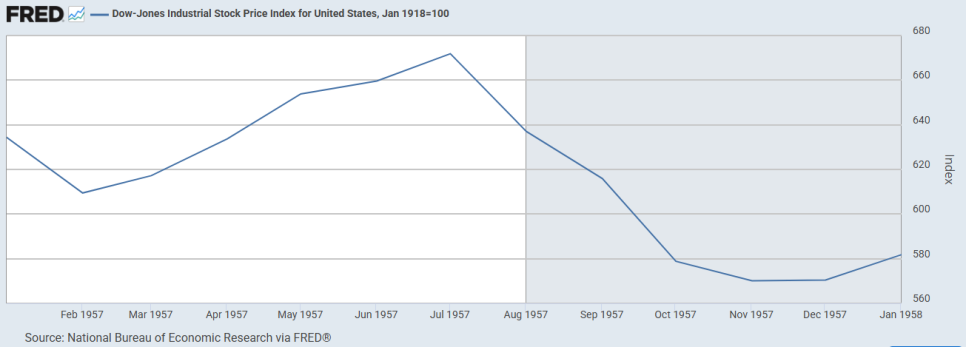

# 1957년 버핏 파트너쉽 서한: 전문, 번역, 분석

## 1957년 미국 주식 시장

*1957년 다우 존스 차트. FRED.*

1957년이 시작되었을 때 미국의 주식 시장은 낙관론을 기반으로 꾸준한 상승을 이어나갔다. 1957년 다우존스 지수는 479.16 포인트에서 시작하여, 7월에는 520 포인트를 돌파하며 순항하였다.  

하지만 이면에서는 경기 호황으로 인한 인플레이션이 심화되고 있었다. 1955년부터 인플레이션 억제 정책을 시행하던 연준은, 1957년 8월 23일에 재할인율을 기존 3.00%에서 3.50%로 인상하였다. 연준 의장은 매우 강경한 발언을 이어나가며 인플레이션 억제에 대한 강한 의지를 표명하였다.  

1957년 8월에 주가가 하락하기 시작하며 경기 침체를 예고하였다. 추후, 전미경제연구소는 1957년 8월부터 경기침체가 시작되었다는 판단을 내린다.  

경기가 침체되기 시작하며 여러 요인들이 분석되기 시작한다 (재정 지출 감소, 자본재 투자 사이클 피크 아웃, 내구재 소비 둔화 등).  

1957년 10월 4일에 소련은 인류 최초의 인공위성 '스푸트니크 1호'의 발사를 성공한다. 이 '스푸트니크 쇼크'는 경제적인 불안에 지정학적 공포라는 기름을 부었다. 시장은 급속도로 냉각되기 시작한다.  

1957년 11월 15일에 연준은 재할인율을 기존 3.50%에서 3.00%로 인하한다. 해당 조치로 인하여 시장은 하락세를 멈춘다.  

최종적으로 다우 존스는 1957년에 -12.77%를 기록한다.  

## 1957년 버핏 파트너쉽 요약

제너럴스(The Generals)와 워크아웃(The Workouts)  
당시 버핏의 투자 전략은 크게 두가지로 이원화되어 있다. 하나는 제너럴스(The generals)고 하나는 워크아웃(The worksouts)이다.  

제너럴스는 일반 주식 투자로서 우리가 흔히 아는 벤자민 그레이엄 방식의 담배꽁초 투자다. 매우 저평가 되어 있는 종목에 대한 투자.  

워크아웃은 합병, 청산, 공개매수 등 특정 이벤트와 관련된 차익거래를 노리는 방식.  

시장이 좋을 때는 제너럴스가 투자 수익률을 견인하고, 시장이 좋지 않을 때에는 워크아웃이 적당한 수익률을 보장한다.  

시장이 저평가이면 제너럴스의 비중을 늘리고, 시장이 고평가라면 워크아웃의 비중을 늘린다.  

버핏의 당시 시장 판단  
당시 전반적인 시장 상황이 고평가 상황이라고 판단했다.  

연말에 시장이 하락하여 일반 주식(제너럴스)의 비중을 늘렸다. 직전 해인 1956년 말에 일반 주식과 워크아웃의 비중이 약 70대 30이었으나, 1957년 말에는 약 85대 15가 됐다.  

시장이 저평가 상태가 되면 모든 비중이 일반 주식 투자에만 투입될 수도 있고, 차입도 가능하다.  

파트너쉽의 성과  
다우존스는 -12.77%만큼 하락하였다.  

버핏이 운용하는 3개의 파트너쉽은 각각 6.2%, 7.8%, 25%의 수익을 기록하였다. 수익률의 차이는 결성 시점과 이에 따른 자본 투입 시점의 차이로 인한 것이다.  

약세장에서는 시장보다 성과가 좋을 것이고, 강세장에서는 시장 수익률을 따라만 가도 만족할 것이다.  

장기적으로 시장 지수보다 10% 초과 수익을 내면 매우 만족할 것이다.  

## 서한 전문

1957년 서한  
워런 E. 버핏  
5202 언더우드 애비뉴, 오마하, 네브래스카  

제2차 유한책임사원 연례 서한  

1957년 주식 시장 개관  

작년 사원 여러분께 보낸 서한에서 저는 다음과 같이 말씀드렸습니다.  

전반적인 시장 수준이 내재가치 이상으로 가격이 형성되어 있다는 것이 제 견해입니다. 이는 우량주에 관한 견해입니다. 이 견해가 정확하다면, 저평가된 주식과 그렇지 않은 주식 모두를 포함한 모든 주가가 상당 폭 하락할 가능성이 내포되어 있습니다. 어떠한 경우에도 현재 시장 수준이 5년 뒤에 저렴했다고 생각될 확률은 매우 희박하다고 봅니다. 그러나 본격적인 약세장이 오더라도 저희 워크아웃(work-out) 포트폴리오의 시장가치에는 큰 타격을 주지 않을 것입니다.  

만약 시장 전반이 저평가 상태로 돌아간다면, 저희 자본은 오직 일반 주식에만 투입될 수 있으며, 이 과정에서 일부 차입금을 활용할 수도 있습니다. 반대로 시장이 상당히 상승한다면, 저희의 방침은 이익이 발생하는 대로 일반 주식 비중을 줄이고 워크아웃 포트폴리오를 늘리는 것입니다.  

위의 모든 내용이 시장 분석을 제 최우선 순위에 둔다는 것을 의미하지는 않습니다. 저의 주된 관심은 항상 상당히 저평가된 증권을 발굴하는 데 있습니다.  

지난 한 해 주가는 완만한 하락세를 보였습니다. 제가 "완만한"이라는 단어를 강조하는 이유는, 언론을 대충 읽거나 최근에 주식 경험을 한 사람들과 대화하면 훨씬 더 큰 하락이 있었다는 인상을 받기 쉽기 때문입니다. 실제로 제가 보기에 주가 하락폭은 현재의 사업 환경 하에서의 기업 이익 창출 능력 감소폭보다 상당히 작았습니다. 이는 대중이 여전히 우량주와 전반적인 경제 상황에 대해 매우 낙관적이라는 것을 의미합니다. 저는 사업이나 주식 시장을 예측하려 하지 않습니다. 위의 내용은 주가가 급격히 하락했다거나 전반적인 시장이 낮은 수준에 있다는 생각을 없애기 위함일 뿐입니다. 저는 여전히 장기 투자 가치에 근거할 때 전반적인 시장이 고평가되어 있다고 생각합니다.  

1957년 활동 내역  

시장 하락으로 저평가 종목들 사이에서 더 큰 기회가 생겨났고, 그 결과 일반적으로 저희 포트폴리오는 작년에 비해 워크아웃보다 저평가 종목의 비중이 더 커졌습니다. "워크아웃"이라는 용어에 대한 설명이 필요할 것 같습니다. 워크아웃은 저평가 종목처럼 주가의 전반적인 상승보다는 특정 기업 활동에 수익이 좌우되는 투자입니다. 워크아웃은 매각, 합병, 청산, 공개매수 등을 통해 발생합니다. 각 경우의 위험은 경제 상황이 악화되거나 주가가 전반적으로 하락하는 것이 아니라, 무언가 계획을 틀어지게 하여 예정된 활동이 중단되는 것입니다. 1956년 말, 저희는 일반 주식과 워크아웃의 비율이 약 70대 30이었습니다. 지금은 약 85대 15입니다.  

지난 한 해 동안 저희는 두 가지 상황에서 포지션을 구축했으며, 그 규모는 저희가 기업 의사 결정에 어느 정도 참여할 수 있을 것으로 기대되는 수준에 이르렀습니다. 이 중 한 포지션은 여러 파트너십 포트폴리오의 10%에서 20%를 차지하며, 다른 하나는 약 5%를 차지합니다. 이 두 건은 아마 3년에서 5년 정도의 시간이 소요될 것이지만, 현재로서는 최소한의 위험으로 높은 연평균 수익률을 올릴 잠재력이 있어 보입니다. 이들은 워크아웃으로 분류되지는 않지만, 주식 시장의 전반적인 움직임에 대한 의존도가 매우 낮습니다. 물론, 만약 시장 전반이 큰 폭으로 상승한다면, 저희 포트폴리오의 이 부분은 시장의 움직임에 뒤처질 것으로 예상합니다.  

1957년 실적  

1957년에 저희가 1956년에 결성한 세 파트너십은 전반적인 시장보다 훨씬 좋은 성과를 냈습니다. 연초에 다우존스 산업평균지수는 499였고 연말에는 435로 64포인트 하락했습니다. 만약 다우존스 평균지수를 보유했다면, 22포인트의 배당을 받아 총손실은 42포인트, 즉 8.470%로 줄었을 것입니다. 이 손실률은 대부분의 투자 펀드에 투자했을 때 얻었을 결과와 거의 비슷하며, 제가 알기로는 주식에 투자한 어떤 투자 펀드도 그 해에 수익을 내지 못했습니다.  

1956년에 설립된 세 파트너십 모두 1956년 연말 순자산 대비 각각 약 6.2%, 7.8%, 25%의 수익을 기록했습니다. 당연히 마지막 파트너십의 월등한 성과에 대해, 특히 처음 두 파트너십의 사원들께서는 의문을 가지실 것입니다. 이 성과는 단기적으로 운이 얼마나 중요한지, 특히 자금이 언제 유입되는지가 얼마나 중요한지를 강조합니다. 세 번째 파트너십은 1956년 가장 늦게 시작되었는데, 그때는 시장이 더 낮은 수준이었고 몇몇 증권들이 특히 매력적이었습니다. 자금 여력이 있었기에 이들 종목에 대해 큰 포지션을 잡을 수 있었습니다. 반면, 더 일찍 결성된 두 파트너십은 이미 상당 부분 투자가 이루어진 상태였기 때문에 이들 종목에 대해 상대적으로 작은 포지션만 취할 수 있었습니다.  

기본적으로 모든 파트너십은 동일한 증권에 거의 같은 비율로 투자됩니다. 그러나 특히 초기 단계에서는 자금이 각기 다른 시점과 다른 시장 수준에서 유입되므로, 향후 몇 년 후보다 실적 변동성이 더 클 수 있습니다. 장기적으로 저는 평균지수보다 연 10% 더 나은 성과를 낸다면 매우 만족할 것입니다. 그런 점에서 이 세 파트너십에게 1957년은 성공적이었고 아마도 평균보다 나은 한 해였습니다.  

두 개의 파트너십이 1957년 중반에 시작되었고, 연말까지의 실적은 1957년 파트너십 설립 이후 약 12% 하락한 평균지수의 성과와 거의 같았습니다. 이들의 포트폴리오는 이제 1956년 파트너십의 포트폴리오와 유사해지기 시작했으며, 향후 전체 그룹의 성과는 훨씬 더 비슷해질 것입니다.  

실적에 대한 해석  

어느 정도는 저희의 1957년 평균 이상 성과가 대부분의 주식에 전반적으로 부진한 해였다는 사실에 기인합니다. 저희의 상대적 성과는 강세장보다 약세장에서 더 좋을 가능성이 높으므로, 위 결과에서 얻는 결론은 저희가 상대적으로 좋은 성과를 냈어야만 했던 해였다는 사실을 감안하여 조절되어야 합니다. 시장 전반이 상당한 상승을 기록하는 해에는, 저는 평균지수의 상승률만큼만 따라가도 매우 만족할 것입니다.  

저희 포트폴리오는 1956년 말보다 1957년 말에 더 나은 가치를 지니고 있다고 확실히 말할 수 있습니다. 이는 전반적으로 낮아진 가격과, 인내심을 갖고서만 매수할 수 있는 상당히 저평가된 증권을 매입할 시간이 더 많았기 때문입니다. 앞서 언급했듯이 저희의 가장 큰 포지션은 여러 파트너십 자산의 10%에서 20%를 차지했습니다. 저는 시간이 지나면 이 포지션이 모든 파트너십 자산의 20%를 차지하도록 할 계획이지만, 이는 서두를 수 없는 일입니다. 분명히, 매수 기간 동안 저희의 주된 관심사는 주가가 오르기보다는 그대로 있거나 하락하는 것입니다. 따라서 어느 시점에서든 저희 포트폴리오의 상당 부분은 휴지기(sterile stage)에 있을 수 있습니다. 이러한 정책은 인내심을 요구하지만, 장기 이익을 극대화할 것입니다.  

개별 종목에 대한 언급 없이 전달할 수 있는 한도 내에서, 여러분이 관심을 가질 만한 점들을 다루고 저희의 철학을 최대한 공개하고자 노력했습니다. 운영의 어떤 측면에 관해서든 질문이 있으시면 언제든 기쁘게 답변해 드리겠습니다.  

---
*원문 출처: [https://blog.naver.com/flionte/224036032299](https://blog.naver.com/flionte/224036032299)*
