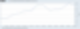

# 1959년 버핏 파트너쉽 서한: 집중 투자와 시장에 대한 불신

## 1959년 미국 시장

*1959년 다우 존스 산업 주가 지수. NBER의 재조정(1918년 1월 = 100). FRED.*

1957년 하반기부터 1958년 상반기까지 이어진 경기 침체가 지나가고 이어진 강력한 회복세가 1959년까지 이어졌다. 경제가 견조하게 회복과 성장을 이어나가며 시장 전반에 낙관론을 확산시킨다.

연준은 1958년 9월부터 시작된 긴축 기조를 유지한다. 연준은 물가 안정을 최우선 목표로 하고 있음을 재확인한다.

1959년 3월 7일,
연준은 재할인율을 2.50%에서 3.00%로 50bp 인상
한다.

1959년 5월 29일,
연준은 재할인율을 3.00%에서 3.50%로 50bp 인상
한다.

1959년 7월 15일,
전국적인 철강 파업
이 시작된다. 미국 철강 노조 소속 노동자들이 파업을 돌입하였으며, 이 파업은 미국 역사상 가장 긴 전국 단위의 파업 중 하나로, 거의 모든 제철소의 가동을 중단시키며 국가 경제에 심각한 충격을 주기 시작한다.

파업이 장기화되며 철강 재고가 고갈되기 시작한다. 자동차, 철도, 건설 등 주요 산업이 직접적인 타격을 입는다.
GM은 약 6만 명의 생산직 노동자를 해고
한다.

1959년 9월 11일,
연준은 재할인율을 3.50%에서 4.00%로 인상
한다. 철강 파업으로 인한 경기의 타격에도 불구하고, 연준은 인플레이션 억제를 최우선 목표로 삼는다.

철강 파업이 국가 경제와 안보를 위협하는 수준에 이른다.

1959년 10월 7일, 아이젠하워 대통령은 태프트-하틀리 법의 비상 조항을 발동하여 철강 파업에 개입한다.

1959년 11월 7일, 미국 대법원은 행정부의 요청을 받아들여 파업에 대한 사실상 금지 명령을 발동한다. 이에 따라 파업이 사실상 종료된다.

1959년 한 해 동안
다우존스 산업지수는 16.4%의 높은 상승
률을 기록하였으나 상승한 종목보다 하락한 종목이 더 많았고, 운송과 유틸리티와 같은 당시의 핵심 산업들에서는 상당한 하락을 기록하는 등의 취약성을 나타냈다.

또한, 1929년 이후 처음으로
주식 배당 수익률이 국채 수익률보다 낮아지는 역 수익률 갭이 발생
한다.

## 1959년 버핏 파트너쉽: 요약 및 분석

파트너쉽의 수익률: 평균 25.9%

버핏이 운영하는 6개의 파트너쉽은 22.3%에서 30.0%에 이르는 수익률을, 평균적으로는 25.9%을 달성한다.
다우 존스의 19.9% 수익률(배당 포함)
을 상당히 초과한 성과를 거둔다.

보수적 가치 평가 기준의 고수

버핏은 1959년 시장의 상당히 상승하였으나 그 상승은 상당히 왜곡되었음을 지적한다. 또한, 우량주의 주가가 투기적 요소가 반영된 우려할 수준이라고 지적한다.

버핏은 새로운 시대(New Era)로 인해 가치 평가 방식이 달라져야 한다는 의견을 거부한다. "영구적인 자본 손실의 결과를 감수하기보다는, 과도한 보수주의로 인한 불이익을 감수" 하겠다는 단호한 의지를 드러낸다.

집중투자: 35%의 자산을 한 종목에

직전 해인 1958년에 한 종목에 25%의 순자산을 투입하였다. 해당 종목에 대한 비중을 더 늘려서 1959년에는 그 비중이 35%에 이르게 된다.

해당 종목이 보유하고 있는 증권들의 가치가 그 자산 가치 대비 상당한 할인 가격에 이루어졌다는 것에 착안하여 포지션을 계속 늘리며 결국 최대 주주의 지위를 확보한다.

또한, 버핏의 투자 전략에 대해 다른 두 대주주의 동의를 이끌어내며, 내재가치를 실현하기 위한 적극적인 행동주의에 나서고 있음을 시사한다.

시장으로부터 독립: 워크아웃

버핏은 기업의 인수, 합병, 청산, 구조조정과 같은 특정 이벤트의 성사 여부에 따라 수익이 결정되는 일종의 차익거래인 "워크아웃"을 지속하며, "시장의 전반적인 움직임으로부터 최소한 부분적이라도 차단된 상황에 계속 투자하려고 노력한다"라고 강조한다.

거시경제의 불확실성이 크고 시장의 밸류에이션이 부담스러운 상황에서, 자본을 보존하고 예측 가능한 수익을 창출하기 위한 전략이다.

## 1959년 서한 전문

1959년 서한
워런 E. 버핏
5202 언더우드 애비뉴, 오마하, 네브래스카

1959년 주식 시장 개관:

의심할 여지 없이 가장 널리 사용되는 주식 시장 동향 지수인 다우존스 산업평균지수는 1959년에 다소 왜곡된 그림을 보여주었습니다. 이 지수는 583에서 679로, 즉 연간 16.4% 상승을 기록했습니다. 평균지수 보유를 통해 수령했을 배당을 더하면, 1959년의 총수익률은 19.9%로 나타났습니다.

이러한 강세장 지표에도 불구하고, 해당 연도 뉴욕증권거래소에서는 상승한 종목(628)보다 하락한 종목(710)이 더 많았습니다. 다우존스 운송업 평균지수와 유틸리티 평균지수 모두 하락을 기록했습니다.

대부분의 투자 신탁은 산업평균지수와 비교하여 어려운 시기를 보냈습니다. 미국 최대의 폐쇄형 투자회사(총자산 4억 달러)인 트라이-콘티넨탈 코퍼레이션(Tri-Continental Corp.)은 연간 약 5.7%의 총수익률을 기록했습니다. 이 회사의 프레드 브라운 사장은 최근 애널리스트 협회 연설에서 1959년 시장에 대해 다음과 같이 말했습니다.

"그러나 저희는 포트폴리오를 좋아함에도 불구하고, 1959년 트라이-콘티넨탈 보유 종목의 시장 성과는 실망스러웠습니다. 1959년처럼 투자 심리와 열기가 큰 역할을 하는 시장은 가치에 기반하여 훈련받고 장기 투자를 지향하는 투자 운용역에게는 어려운 시장입니다. 아마도 저희가 우주 장화를 제대로 조이지 못했나 봅니다(* 비정상적인 상황에서의 준비가 잘 안됐던 것 같다는 의미). 하지만 저희는 트라이-콘티넨탈과 같은 투자 기관이 주주의 자금으로 감수해야 할 위험에는 한계가 있다고 믿으며, 포트폴리오가 다가올 해를 위해 잘 준비되어 있다고 믿습니다."

자산 15억 달러 규모의 미국 최대 뮤추얼 펀드인 매사추세츠 인베스터스 트러스트(Massachusetts Investors Trust)는 연간 약 9%의 총수익률을 기록했습니다.

여러분 대부분은 제가 수년간 주식 시장의 전반적인 수준에 대해 매우 우려해 왔다는 것을 알고 계십니다. 현재까지 이러한 신중함은 불필요했습니다. 이전 기준에 따르면, 현재 '우량주'의 가격 수준은 상당한 투기적 요소를 포함하고 있으며 그에 상응하는 손실 위험을 안고 있습니다. 아마도 기존 기준을 영구적으로 대체할 다른 가치평가 기준이 생겨나고 있는지도 모릅니다. 저는 그렇게 생각하지 않습니다. 제가 틀릴 수도 있습니다. 하지만 저는 나무가 하늘까지 자란다고 믿는 '신시대' 철학을 채택하여 발생할 수 있는 오류, 즉 영구적인 자본 손실의 결과를 감수하기보다는, 과도한 보수주의로 인한 불이익을 감수하겠습니다.

1959년 실적:

이전 서한들에서는 하락장 또는 보합장에서 상대적으로 좋은 실적(일반 시장 지수 및 주요 투자 신탁 대비)을 내지만, 급등장에서는 상대적으로 인상적이지 않은 실적을 내는 것을 제안된 성과 기준으로 강조해 왔습니다.

저희는 운 좋게도 1959년에 상당히 좋은 실적을 달성했습니다. 한 해 내내 운영된 6개의 파트너십은 22.3%에서 30.0%에 이르는 총순수익률을 달성했으며, 평균적으로 약 25.9%를 기록했습니다. 이 파트너십들의 포트폴리오는 현재 약 80% 유사하지만, 증권 및 현금 유입 시점, 사원에게 지급된 금액 등의 차이로 인해 약간의 차이가 있습니다. 지난 몇 년간, 매년 꾸준히 성과가 최상위이거나 최하위인 파트너십은 없었으며, 포트폴리오가 점차 유사해짐에 따라 그 격차도 좁혀지고 있습니다.

총순수익률은 연초 및 연말 시장가치를 기준으로, 사원에게 지급된 금액이나 사원으로부터 받은 출자금을 조정한 후 결정됩니다. 이는 연중 실제 실현이익을 기준으로 하는 것이 아니라, 해당 연도의 청산가치 변화를 측정하기 위한 것입니다. 이는 (파트너십 계약에 명시된 경우) 사원에게 지급되는 이자와 업무집행사원에게 이익이 분배되기 전, 그러나 운용 비용은 차감한 후의 수치입니다.

주요 운용 비용은 네브래스카 무형자산세로, 이는 거의 모든 증권 시장가치의 0.4%에 해당합니다. 작년은 이 세금이 효과적으로 시행된 첫해였으며, 당연히 저희 실적에 0.4%만큼의 불이익을 주었습니다.

현재 포트폴리오:

작년에 저는 여러 파트너십 자산의 약 25%를 차지하는 새로운 투자를 언급했습니다. 현재 이 투자는 자산의 약 35%를 차지합니다. 이는 이례적으로 높은 비율이지만, 확실한 이유가 있어 이루어졌습니다. 사실상 이 회사는 약 30~40개의 다른 우량 증권을 소유한 부분적인 투자 신탁입니다. 저희의 투자는 해당 회사가 보유한 증권의 시장가치에 기반한 자산가치와 운용 사업에 대한 보수적인 평가액보다 상당한 할인된 가격에 이루어졌고 장부에 계상되어 있습니다.

저희는 상당한 차이로 이 회사의 최대 주주이며, 다른 두 대주주도 저희의 생각에 동의합니다. 이 투자의 성과가 처분 시점까지 시장 전반의 성과를 능가할 확률은 매우 높으며, 저는 이것이 올해 안에 이루어지기를 희망합니다.

포트폴리오의 나머지 65%는 제가 저평가되었다고 생각하는 증권과 워크아웃 종목으로 구성되어 있습니다. 저는 가능한 한, 시장의 전반적인 움직임으로부터 최소한 부분적으로라도 차단된 상황에 계속 투자하려고 노력합니다.

이러한 정책은 약세장에서는 우수한 성과를, 강세장에서는 평균적인 성과를 가져올 것입니다. 이 서한을 쓰는 현시점에 다우존스 산업평균지수가 1959년 상승분의 절반 이상을 되돌렸으므로, 첫 번째 예측은 올해 시험대에 오를 수 있습니다.

질문이 있으시거나 제가 어떤 점에서든 명확하게 설명하지 못한 부분이 있다면, 기꺼이 답변해 드리겠습니다.

워런 E. 버핏
1960년 2월 20일

첨부파일
(3)1959
.pdf
파일 다운로드

---
*원문 출처: [https://blog.naver.com/flionte/224040102251](https://blog.naver.com/flionte/224040102251)*
