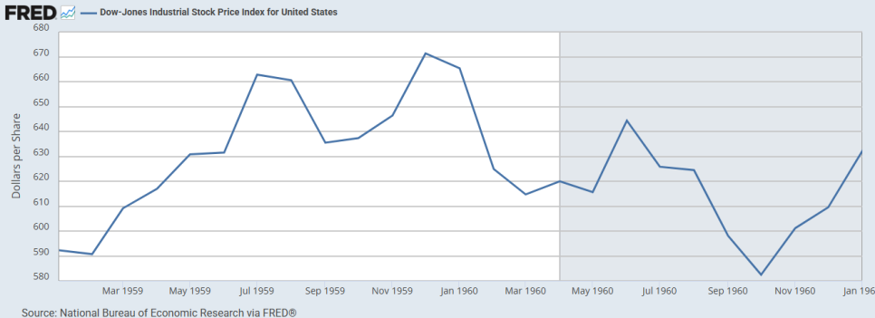

# 1961년 상반기 버핏 파트너쉽 서한: 투자 보수 조건 변경

## 1961년 미국 시장

*1961년 다우 존스 산업 주가 지수. NBER의 재조정(1918년 1월 = 100). FRED.*

직전 해인 1960년은 다우존스 산업평균지수가 9.3% 하락하는 약세장으로 마감했다. 전미경제연구소(NBER)이 1960년 4월을 기점으로 선언한 경기 침체는 1961년 초까지 이어지고 있었으며, 실업률은 6% 후반대에 머물렀다. 연준은 1960년 8월 재할인율을 3.00%까지 인하하며 경기 부양 기조를 유지하고 있었다.  

1961년 1월 20일, 민주당의 존 F.케네디가 제35대 미국 대통령으로 취임한다. 케네디 행정부는 "새로운 개척(New Frontier)"을 내세우며 경기 침체 극복을 위한 국방비 증액과 감세 등의 확장적인 재정 정책을 예고한다.  

1961년 2월, 미국 경제가 마침내 침체의 저점에 도달한다. 전미경제연구소는 훗날 1961년 2월을 기점으로 미국 경제가 10개월간의 짧은 침체를 끝내고 공식적인 확장 국면에 진입했다고 선언한다.  

1961년 2월, 연준은 새로운 통화 정책 실험인 "오퍼레이션 트위스트(Operation Twist)"를 시작한다. 이는, 재할인율(3.00%)은 동결한 채, 연준이 단기 국채를 매도하는 동시에 동일한 규모의 장기 국채를 매입하는 방식이었다. 이 정책의 목표는 단기 금리는 높게 유지하여 달러 가치와 금의 유출을 방어하고, 장기 금리는 낮춰 기업의 설비 투자와 주택 모기지를 촉진하려는 것이었다.  

1961년 4월 17일, 미국이 지원한 쿠바 망명자들의 피그스만 침공 시도가 실패한다. 이 사건은 신생 케네디 행정부에 큰 외교적 타격을 주었으며, 지정학적 긴장을 고조시켰다.  

1961년 8월 13일, 소련이 동독의 베를린 장벽 건설을 승인하고 국경을 봉쇄한다. 미소 간의 냉전 대립이 격화되며 제3차 세계대전에 대한 공포가 커진다.  

1961년은 강력한 강세장으로 한 해를 마감한다. 경기 침체가 예상보다 빠르게 종료되고, 케네디 행정부의 확장 재정 정책과 연준의 오퍼레이션 트위스트를 통한 장기 금리 안정화가 시장에 활력을 불어넣었다.  

다우존스 산업지수는 연간 18.7% 상승했다. 배당을 포함한 총 수익률은 약 23.1%를 기록했다.  

## 1961년 상반기 파트너쉽 서한 요약

파트너쉽의 성과에 대하여  
상대적 성과 원칙의 재확인: 강세장에서는 시장 상승률을 따라가기 어려울 수 있음.  
장기적 관점의 중요성: 6개월이나 1년은 성과를 판단하기 너무 이른 기간임. 최소 5년 단위의 장기적 관점에서 성과를 평가해야 함.  

투자 전략  
보수적 포트폴리오 운용: 시장이 상승할수록, 포트폴리오를 더욱 보수적으로 운용. 시장의 움직임으로부터 부분적으로 보호받는 자산의 비중을 늘림.  
장기적 대규모 투자 진행 중: 잠재적으로 큰 비중을 차지할 투자처에 매수를 시작함. 매수하는 기간 동안 주가가 오르지 않기를 기대.  

파트너쉽의 통합  
연말까지 모든 파트너쉽을 하나라 통합할 계획  
새로운 이익 분배 구조: 기초 자본금의 6% 수익을 투자자에게 우선 배분. 6%를 초과하는 이익에 대해 버핏이 25%, 투자자들이 75%를 가져감. 기존의 복잡했던 3가지 분배 방식을 단일화.  
파트너 유동성 편의: 투자한 지분 가치의 최대 20%까지 연 6% 이율로 대출받을 수 있는 권리를 부여.  
이해관계 일치: 버핏과 그의 아내가 통합 파트너쉽의 최대 투자자(전체 자산의 약 1/6)가 될 것. 버핏과 그의 가족은 파트너쉽 외부에서 다른 시장성 유가증권을 매수하는 것이 금지.  

## 1961년 상반기 서한 전문

버핏 파트너쉽  
810 키위트 플라자  
오마하 31, 네브래스카  
1961년 7월  

파트너 여러분께:  

과거 파트너들께서는 연례 서한이 “술 한잔하고 다음 잔까지의 시간이 너무 길다(“a long time between drinks)”는 평과 함께, 반기 서한을 보내는 것이 좋겠다는 의견을 주셨습니다. 1년에 두 번 드릴 말씀을 찾는 것이 그리 어렵지는 않을 것입니다. 적어도 올해는 그렇지 않습니다. 따라서 앞으로도 계속해서 이 서한을 보내드릴 것입니다.  

1961년 상반기 동안 다우존스 산업평균지수의 전체 수익률은 배당을 포함하여 약 13%였습니다. 이러한 시기는 저희가 이 기준을 초과하기 가장 어려운 유형의 기간임에도 불구하고, 6개월 내내 운용된 모든 파트너쉽은 평균지수보다 완만하게 더 나은 성과를 거두었습니다. 1961년 중에 결성된 파트너쉽들은 주로 운용 기간에 따라, 결성 시점부터 평균지수와 같거나 이를 초과하는 실적을 보였습니다.  

그러나 두 가지 점을 강조하고자 합니다. 첫째, 1년은 투자 성과에 대한 어떤 종류의 의견을 형성하기에는 너무 짧은 기간이며, 6개월을 기준으로 한 측정은 훨씬 더 신뢰할 수 없습니다. 제가 반기 서한 작성을 다소 꺼렸던 한 가지 이유는 파트너들께서 가장 오해하기 쉬운 단기 성과를 기준으로 생각하기 시작할지도 모른다는 우려 때문이었습니다. 저 자신의 생각은 5년 단위의 성과에 훨씬 더 맞춰져 있으며, 가급적 강세장과 약세장 모두에서의 상대적 성과를 시험하는 것을 선호합니다.  

제가 모든 분이 이해해 주시길 바라는 두 번째 점은, 만약 시장이 1961년 상반기와 같은 속도로 계속 상승한다면, 저희가 다우존스 산업평균지수의 성과를 계속해서 초과할 것이라고 의심할 뿐만 아니라, 저희의 성과가 평균지수에 뒤처질 가능성이 매우 높다는 것입니다.  

제가 항상 일반 포트폴리오에 비해 보수적인 편이라고 믿는 저희 보유 종목들은, 전반적인 시장 수준이 상승함에 따라 더욱 보수적으로 되는 경향이 있습니다. 저는 항상 저희 포트폴리오의 일부를 최소한 시장의 움직임으로부터 부분적으로나마 보호받는 증권으로 보유하려고 하며, 이 부분은 시장이 상승함에 따라 늘어나야 합니다. 아마추어 요리사에게는(그리고 아마추어에게는 특히 더) 그 결과가 군침 돌게 보일지라도, 저희는 포트폴리오 중 더 많은 부분이 당장의 수익을 위해 운용되고 있지 않다는 것을 발견하게 됩니다.  

저희는 또한 잠재적으로 주요 투자가 될 종목의 공개 시장 매수를 시작했으며, 물론 저는 이 종목이 최소 1년간은 시장에서 아무런 움직임이 없기를 바랍니다. 이러한 투자는 단기 성과에 저해 요인이 될 수 있지만, 상당한 방어적 특성과 결합하여 수년의 기간에 걸쳐 우수한 결과를 약속하게 될 것입니다.  

연말에 모든 파트너쉽을 통합하는 작업에 진전이 있었습니다. 저는 지난 1년여 동안 합류한 모든 파트너와 이 목표에 관해 이야기했으며, 모든 초기 파트너십의 대표 파트너들과도 계획을 검토했습니다.  

몇 가지 조항은 다음과 같습니다.  

(A) 연말 시장가치를 기준으로 모든 파트너쉽을 합병하며, 연말 미실현 이익으로 인한 미래의 조세 채무를 파트너 간에 적절히 배분하는 조항을 둡니다. 합병 자체는 비과세이며, 이익 실현을 가속화하지 않을 것입니다.  

(B) 유한책임사원과 무한책임사원 간의 이익 분배는, 파트너에게 시장가 기준 기초 자본금의 연 6%를 우선 배분하고, 초과분은 4분의 1을 무한책임사원에게, 4분의 3을 모든 파트너에게 자본금에 비례하여 배분합니다. 수익이 6%에 미달하는 결손분은 미래 이익에서 차감하도록 이월되지만, 소급 적용되지는 않습니다. 현재, 신규 파트너에게 선택적으로 제공되는 세 가지 이익 분배 약정이 있습니다.  

|  | 수수료 지급 조건 | 무한책임사원 초과 이익분 | 유한책임사원 초과 이익분 |
| --- | --- | --- | --- |
| (1) | 6% | 1/3 | 2/3 |
| (2) | 4% | 1/4 | 3/4 |
| (3) | 없음 | 1/6 | 5/6 |

이익이 발생할 경우, 새로운 분배 방식은 명백히 처음 두 약정보다 유한책임사원에게 더 유리할 것입니다. 세 번째 약정과 관련하여, 새로운 약정은 연 18% 수익률까지는 더 우수하지만, 그 이상에서는 현재 약정 하에서 유한책임사원들이 더 나은 성과를 거두게 됩니다. 전체 파트너쉽 자산의 약 80%가 처음 두 약정을 선택했으며, 만약 저희가 연평균 18% 이상의 수익을 올린다면, 현재 세 번째 약정 하에 있는 파트너들이 새로운 약정 하에서 손해 봤다고 느끼지 않기를 바랍니다.  

(C) 손실이 발생할 경우, 이전에 무한책임사원인 저에게 배분된 금액에 대해 소급 적용은 없을 것입니다. 다만 미래 초과 이익에서 차감하는 이월은 있을 것입니다. 그러나 제 아내와 저는 새로운 파트너쉽에 가장 큰 단일 투자를 하게 될 것이며, 이는 아마도 전체 파트너쉽 자산의 약 6분의 1에 해당할 것입니다. 따라서 다른 어떤 파트너나 가족 그룹보다 손실에 대한 금전적 이해관계가 더 큽니다. 저는 저나 제 가족이 시장성 있는 유가증권을 매수하는 것을 금지하는 조항을 파트너쉽 계약에 삽입하고 있습니다. 다시 말해, 새로운 파트너쉽은 시장성 있는 유가증권에 대한 저의 모든 투자 활동을 대표하게 될 것이므로, 저의 결과는 저희가 6% 이상의 성과를 낼 경우 제가 얻는 이점을 제외하고는 여러분의 결과와 직접적으로 비례해야 합니다.  

(D) 연초 시장가치 기준 자본금에 근거하여 연 6%의 이율로 월별 지급을 하는 조항. 현재 자금 인출을 원치 않는 파트너는 이를 자동으로 선급금으로 재예치할 수 있으며, 연 6%의 이자를 받아 연말에 파트너쉽의 추가 지분을 매입할 수 있습니다. 이는 통합의 길에 존재했던 하나의 걸림돌을 해결할 것입니다. 많은 파트너는 정기적인 인출을 원하고 다른 파트너는 전액 재투자를 원하기 때문입니다.  

(E) 연중 파트너쉽 지분 가치의 20%까지 연 6%의 이율로 차입할 권리. 해당 대출은 연말 또는 그 이전에 상환되어야 합니다. 이는 현재 연말에만 처분할 수 있는 투자에 어느 정도 유동성을 더해줄 것입니다. 파트너쉽에는 비교적 영구적인 자금 외에는 투자되어서는 안 되며, 저희는 파트너십을 은행으로 만들고자 하는 의사가 없습니다. 오히려 저는 이것이 비교적 사용되지 않는 조항이 될 것으로 예상하며, 예상치 못한 일이 발생하여 파트너 지분 전체의 일부를 청산하기 위해 연말까지 기다리는 것이 어려움을 야기할 때 이용 가능할 것입니다.  

(F) 차후 연도에 파트너쉽의 신고서에 대해 이루어지는, 비교적 작은 세무 조정이 저에게 직접 부과되는 약정. 이런 식으로 저희는 80명 또는 그 이상의 사람들에게 사소한 문제로 이전 신고서를 수정해달라고 요청하는 문제에 직면하지 않을 것입니다. 현재 상태로는, 파트너쉽이 받은 배당금이 68%가 아닌 63%의 자본 환급이라는 결정과 같은 작은 변화가 엄청난 서류 작업을 유발할 수 있습니다. 이를 방지하기 위해, 세액 1,000달러 미만의 변경은 저에게 직접 부과될 것입니다.  

저희는 제안된 계약서를 워싱턴에 제출하여 합병이 비과세이고, 파트너쉽이 세법상 파트너쉽으로 취급된다는 유권해석을 요청했습니다. 이 모든 것이 많은 작업이지만, 미래에는 일을 엄청나게 더 쉽게 만들어 줄 것입니다. 이 서한을 연말에 받으실 계약서와 함께 읽을 참고 자료로 보관해 두시면 좋을 것입니다.  

신규 파트너를 위한 최소 투자금은 현재 25,000달러이지만, 물론 이는 기존 파트너에게는 적용되지 않습니다. 저희의 운영 방식은 파트너들이 연말에 (100달러 단위로) 어떤 규모의 금액이든 추가하거나 인출할 수 있도록 할 것입니다. 파트너쉽의 예상 총자산은 4백만 달러 근방이 될 것이며, 이는 저희가 몇 년 전에는 포기해야 했을, 이 서한에서 앞서 언급한 것과 같은 투자를 고려할 수 있게 해줍니다.  

이 서한이 제 연례 서한보다 더 큰 작업이 되었습니다. 질문이 있으시면, 특히 새로운 파트너쉽 계약에 대한 제 논의에서 명확하지 않은 점이 있다면, 반드시 저에게 알려주시기 바랍니다. 질문이 많이 제기된다면, 모든 파트너에게 제기된 질문과 그에 대한 답변을 담은 보충 서한을 작성하겠습니다.  

워런 E. 버핏  
1961년 7월 22일  

---
*원문 출처: [https://blog.naver.com/flionte/224081556505](https://blog.naver.com/flionte/224081556505)*
