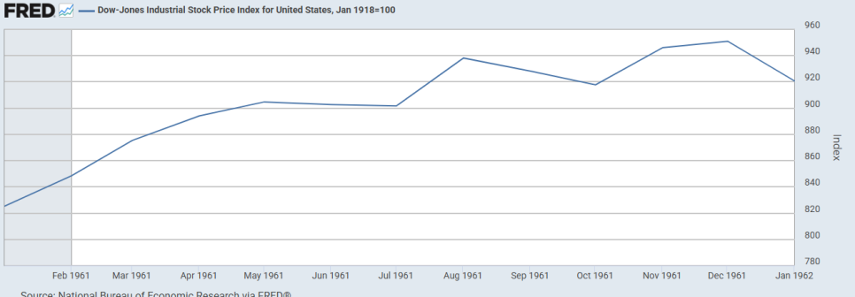
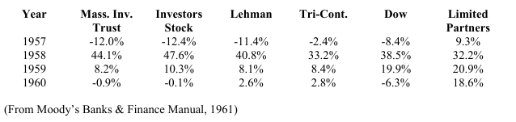
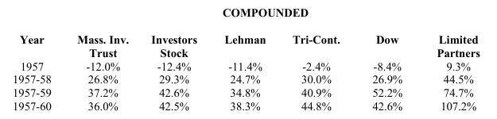
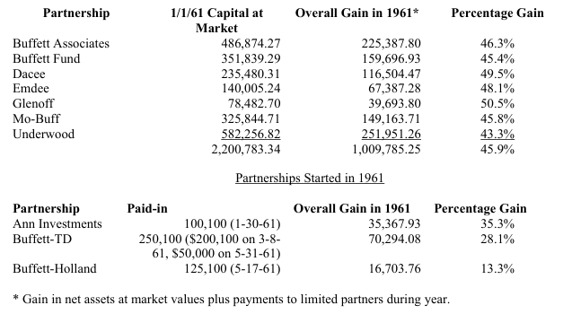

# [1961년 버핏 서한] 수익률 45% 기록, 우량주 맹신에 대한 경고

## 1961년 파트너쉽 서한 요약

1961년 미국 주식 시장은 강력한 강세장을 보인다. 하지만 버핏은 시장의 환호에 휩쓸리지 않고, 오히려 시장이 과열될수록 포트폴리오를 어떻게 방어해야 하는지에 집중한다.  

1961년 서한에서 버핏은 자신의 포트폴리오를 어떤 구조로 나누어 운용하는지, 그리고 그가 생각하는 진정한 보수적 투자란 무엇인지를 명확하게 밝힌다.  

### 1. 압도적 성과

1961년 성과: 다우지수가 22.2%(* 버핏 서한 기준) 상승하는 강세장 속에서, 파트너쉽은 45.9%라는 압도적인 수익률을 기록한다.  
다우지수라는 벤치마크: 버핏은 절대수익률이 아닌 다우지수 대비 성과를 유일한 기준으로 삼는다. 그는 1946년부터 15년간 운영된 대형 뮤추얼 펀드들의 데이터를 제시하며, 다우지수를 이기는 것은 결코 쉬운 일이 아니며, 대부분의 펀드와 투자 기관은 시장을 이기지 못한다고 강조한다.  
평가 기간: 1년이나 6개월의 단기 성과는 의미가 없으며, 최소 3년에서 5년(시장 사이클이 한 바퀴 도는 기간)을 기준으로 평가해야 한다고 강조한다.  

### 2. 포트폴리오의 3가지 분류

버핏은 자금을 성격이 전혀 다른 3가지 범주로 나누어서 투자하며, 이를 통해 시장의 등락과 무관하게 안정적인 수익을 창출하는 구조를 만들어낸다.  

(1) 일반주식 (Generals):  
특징: 명백하게 저평가, 가치 상승을 촉발할 특별한 이벤트 (촉매)나 시간표가 없는 주식.  
전략: 저렴한 가격 자체가 안전마진. 1961년과 같은 강세장에서 가장 높은 수익률을 냈지만, 반대로 폭락장에서는 다우지수만큼 하락할 수 있는 취약점이 있다.  

(2) 워크아웃 (Work-outs):  
특징: 합병, 청산, 기업 분할 등 기업의 특정 이벤트에 의해 수익이 결정되는 주식.  
전략: 시장의 흐름과 무관하여 연 10% - 20%의 안정적인 수익을 낼 수 있다. 결과에 대한 예측 가능성과 안정성이 높기 때문에, 버핏은 이 카테고리에 한해 순자산의 최대 25%까지 차입금을 활용한다고 밝힌다.  

(3) 행동주의 (Control):  
특징: 주식을 대량 매집하여 회사의 경영권을 장악하거나 정책에 직접적인 영향을 미치는 투자.  
전략: 강세장에서는 수익이 나지 않는 답답한 투자처럼 보일 수 있으나, 시장이 폭락할 때 포트폴리오를 보호하는 방어막 역할을 한다. 수년의 시간이 필요하다.  

### 3. 행동주의 (Control) 투자의 실전 사례: 뎀스터 밀 (Dempster Mill)

진행 과정: 5년전 일반 주식(Generals)로 첫 매수 -> 4년 전 이사회 합류 -> 1961년 8월, 지분 70%를 확보하며 경영권 장악.  
가치 평가: 평균 매입가는 28달러, 연말 파트너쉽 장부에 35달러로 평가. 이는 주당 순자산(75달러)이나 운전자본(50달러)에 비해 매우 보수적으로 책정된 가격. 버핏은 시장의 탐욕에 기대지 않고, 기업의 내재가치와 청산가치에 집중한다.  

### 4. 진정한 보수적 투자란?

시장이 과열되자 대중은 우량주를 사면 안전할 것이라고 착각한다. 이에 대해 버핏은 일침을 가한다.  

대중의 착각: 과거에는 국채를 사는 것이 보수적이라고 믿어 인플레이션으로 구매력을 잃었고, 지금은 가격이나 배당을 무시하고 무작정 대형 우량주를 사는 것이 보수적이라고 착각하고 있다. 버핏은 이를 탐욕스럽고 변덕스러운 대중이 매기는 주가 배수(Multiple)에 투기하는 매우 위험한 행동이라고 비판한다.  
버핏의 정의: 다수가 동의한다고, 혹은 유명인이 동의한다고 해서 옳은 것이 아니다. "진정한 보수주의는 오직 정확한 지식과 이성, 그리고 합리적인 가설을 통해서만 가능하다". 버핏은 자신의 투자가 얼마나 보수적인지는 다우지수가 크게 하락하는 하락장에서 명백히 증명될 것이라고 자신한다.  

### 5. 자금 규모의 중가와 향후 10년 예측

운용 규모가 커지면? : 버핏은 자금이 커지면 일반 주식(Generals)를 매집하기는 어려워지지만, 반대로 행동주의(Control) 투자에서는 막대한 자금력이 경쟁자를 없애는 무기가 되기 때문에 성과가 훼손되지 않을 것이라고 설명한다.  
미래 예측과 목표: 버핏은 시장의 방향을 예측하지 않는다. 다만, 장기적으로 다우지수가 연평균 5~7%의 복리 수익을 낼 것으로 가정할 때, 파트너쉽은 다우지수보다 매년 10%p 높은 연 15% ~ 17%의 수익을 내는 것을 목표로 한다.  
하락장을 즐겨라: 버핏은 "시장이 35~40% 폭락하는 해에, 우리는 15~20%만 하락할 것"이라며, 강세장보다 하락장이나 횡보장에서 시장 대비 우위를 점하는 것이 자신의 핵심 목표임을 강조한다.  

## 1961년 미국 시장

*1961년 다우 존스 산업 주가 지수. NBER의 재조정(1918년 1월 = 100). FRED.*

직전 해인 1960년은 다우존스 산업평균지수가 9.3% 하락하는 약세장으로 마감했다. 전미경제연구소(NBER)이 1960년 4월을 기점으로 선언한 경기 침체는 1961년 초까지 이어지고 있었으며, 실업률은 6% 후반대에 머물렀다. 연준은 1960년 8월 재할인율을 3.00%까지 인하하며 경기 부양 기조를 유지하고 있었다.  

1961년 1월 20일, 민주당의 존 F.케네디가 제35대 미국 대통령으로 취임한다. 케네디 행정부는 "새로운 개척(New Frontier)"을 내세우며 경기 침체 극복을 위한 국방비 증액과 감세 등의 확장적인 재정 정책을 예고한다.  

1961년 2월, 미국 경제가 마침내 침체의 저점에 도달한다. 전미경제연구소는 훗날 1961년 2월을 기점으로 미국 경제가 10개월간의 짧은 침체를 끝내고 공식적인 확장 국면에 진입했다고 선언한다.  

1961년 2월, 연준은 새로운 통화 정책 실험인 "오퍼레이션 트위스트(Operation Twist)"를 시작한다. 이는, 재할인율(3.00%)은 동결한 채, 연준이 단기 국채를 매도하는 동시에 동일한 규모의 장기 국채를 매입하는 방식이었다. 이 정책의 목표는 단기 금리는 높게 유지하여 달러 가치와 금의 유출을 방어하고, 장기 금리는 낮춰 기업의 설비 투자와 주택 모기지를 촉진하려는 것이었다.  

1961년 4월 17일, 미국이 지원한 쿠바 망명자들의 피그스만 침공 시도가 실패한다. 이 사건은 신생 케네디 행정부에 큰 외교적 타격을 주었으며, 지정학적 긴장을 고조시켰다.  

1961년 8월 13일, 소련이 동독의 베를린 장벽 건설을 승인하고 국경을 봉쇄한다. 미소 간의 냉전 대립이 격화되며 제3차 세계대전에 대한 공포가 커진다.  

1961년은 강력한 강세장으로 한 해를 마감한다. 경기 침체가 예상보다 빠르게 종료되고, 케네디 행정부의 확장 재정 정책과 연준의 오퍼레이션 트위스트를 통한 장기 금리 안정화가 시장에 활력을 불어넣었다.  

다우존스 산업지수는 연간 18.7% 상승했다. 배당을 포함한 총 수익률은 약 23.1%를 기록했다.  

(이 부분은 직전 글인 1961년 상반기 서한의 내용과 같음)  

## 1961년 파트너쉽 서한 전문

(* 버핏의 의도를 훼손하지 않기 위해, 그 어떠한 첨언도 강조도 하지 않았습니다)  

1961년 서한  
버핏 파트너쉽(BUFFETT PARTNERSHIP, LTD.)  
네브래스카주 오마하 31, 키위트 플라자 810  
1962년 1월 24일  

1961년 성과  

저는 지속적으로 파트너 여러분께 하락장이나 횡보장에서는 전반적인 시장과 비교하여 우리가 상대적으로 선방하리라 기대하고 희망하지만(둘 중 어느 것인지 구별하기는 항상 어렵습니다), 상승장에서는 우리가 그리 좋아 보이지 않을 수 있다고 말씀드려 왔습니다. 강력한 상승장에서는 전반적인 시장의 수익률을 따라가는 데 실질적인 어려움을 겪을 것으로 예상합니다.  

비록 1961년이 전반적인 시장에 확실히 좋은 한 해였고, 추가로 절대적 및 상대적 기준 모두에서 저희에게 매우 좋은 한 해였음에도 불구하고, 앞 문단에서 말씀드린 기대치는 변함이 없습니다.  

1961년 동안 다우존스 산업평균지수(이하 "다우지수")로 측정된 전반적인 시장은 다우지수 보유를 통해 받은 배당금을 포함하여 22.2%의 총 수익률을 기록했습니다. 1년 내내 운영된 모든 파트너쉽의 수익률은 모든 운영 비용을 차감한 후, 유한책임사원(limited partners)에 대한 지급이나 무한책임사원(general partner)에 대한 이익 배분이 이루어지기 전 기준으로 평균 45.9%였습니다. 각 파트너쉽별 수익률의 세부 사항과 연중에 시작된 파트너쉽의 결과는 부록에 나와 있습니다.  

이제 저희는 파트너쉽 운영 만 5년을 채웠으며, 이 5년간의 결과가 연도별 기준뿐만 아니라 누적 또는 복리 기준으로 아래에 제시되어 있습니다. 이 결과들은 앞 문단에서 설명한 기준, 즉 비용 차감 후, 파트너 간의 이익 분배나 파트너에 대한 지급 이전 기준으로 작성되었습니다.  

| 연도 | 파트너쉽 수(1년 내내 운영) | 파트너쉽 수익률 | 다우존스 수익률 |
| --- | --- | --- | --- |
| 1957 | 3 | 10.4% | -8.4% |
| 1958 | 5 | 40.9% | 38.5% |
| 1958 | 6 | 25.9% | 19.9% |
| 1960 | 7 | 22.8% | -6.3% |
| 1961 | 7 | 45.9% | 22.2% |

* 다우지수 보유를 통해 받은 배당금 보함.  

복리 기준으로 누적 결과는 다음과 같습니다.  
| 연도 | 파트너쉽 수익률 | 다우존스 수익률 |
| --- | --- | --- |
| 1957 | 10.4% | -8.4% |
| 1957-58 | 55.6% | 26.9% |
| 1957-59 | 95.9% | 52.2% |
| 1957-60 | 140.6% | 42.6% |
| 1957-61 | 251.0% | 74.3% |

이 결과들은 여러분이 가장 관심을 가지실 유한책임사원의 수익률을 측정한 것은 아닙니다. 과거에 존재했던 다양한 파트너쉽 약정들 때문에, 저는 전반적인 성과를 측정하는 가장 공정한 기준으로 파트너쉽에 대한 전체 순수익률(연초와 연말의 시장 가치 기준)을 사용했습니다.  

현재의 버핏 파트너쉽(Buffett Partnership, Ltd.) 계약에 수반되는 이익 분배 방식에 맞춰 추정(pro-forma) 기준으로 조정하면 결과는 다음과 같았을 것입니다.  

| 연도 | 파트너쉽 수익률 | 다우지수 수익률 |
| --- | --- | --- |
| 1957 | 9.3% | -8.4% |
| 1958 | 32.2% | 38.5% |
| 1958 | 20.9% | 19.9% |
| 1960 | 18.6% | -6.3% |
| 1961 | 35.9% | 22.2% |

| 복리 누적 |
| --- |
| 1957 | 9.3% | -8.4% |
| 1957-58 | 44.5% | 26.9% |
| 1957-59 | 74.7% | 52.2% |
| 1957-60 | 107.2% | 42.6% |
| 1957-61 | 181.6% | 74.3% |

기준(Par)에 대한 한마디  

제가 파트너를 선정할 때와 그 이후 파트너들과 관계를 맺을 때 가장 중요하게 생각하는 점은 우리가 같은 잣대(yardstick)를 사용하기로 결정하는 것입니다. 제 실적이 부진하다면 저는 파트너들이 자금을 회수할 것을 예상하며, 사실상 저 자신의 자금을 투자할 새로운 곳을 찾아야만 합니다. 실적이 좋다면, 저는 훌륭한 성과를 거두고 있다고 확신할 수 있으며, 이는 제가 충분히 적응할 수 있는 긍정적인 상황입니다.  

따라서 문제는 우리 모두가 무엇이 좋은 것이고 무엇이 나쁜 것인지에 대해 동일한 생각을 가지고 있는지 확인하는 데 있습니다. 저는 실행에 앞서 잣대를 확립해야 한다고 믿습니다. 사후적으로 본다면, 어떤 것과 비교하느냐에 따라 거의 모든 것이 좋아 보이게 만들 수 있기 때문입니다.  

저는 다우존스 산업평균지수를 우리 기준의 척도로 계속 사용해 왔습니다. 제 생각에는 3년은 성과를 평가하기 위한 아주 최소한의 기간이며, 다우지수의 기말 수준이 기초 수준과 합리적으로 가까운 최소 그 정도 길이의 기간이 가장 좋은 평가 기간이라고 생각합니다.  

다우지수가 성과 측정 지표로서 완벽하지는 않지만(다른 어떤 것도 완벽하지 않듯이), 널리 알려져 있고, 장기간의 연속성을 가지며, 전반적인 시장에 대한 투자자들의 경험을 상당히 정확하게 반영한다는 장점이 있습니다. 다른 주가 평균 지수, 선도적인 분산형 주식 뮤추얼 펀드(mutual funds), 은행 공동신탁기금(bank common trust funds) 등 전반적인 시장 성과를 측정하는 다른 방법이 사용되는 것에는 반대하지 않습니다.  

30개의 선도적인 우량주로 구성된 비관리형 지수(unmanaged index)보다 더 나은 성과를 내는 것이 꽤 간단해 보인다는 점에서, 제가 너무 낮은 잣대를 세웠다고 느끼실 수도 있습니다. 하지만 실제로 이 지수는 일반적으로 상당히 강력한 경쟁자임이 입증되었습니다. 아서 위즌버거(Arthur Wiesenberger)의 투자회사에 관한 고전적인 저서에는 모든 주요 뮤추얼 펀드들의 1946년부터 1960년까지 15년간의 성과가 나열되어 있습니다. 현재 뮤추얼 펀드에는 200억 달러 이상이 투자되어 있으므로, 이 펀드들의 경험은 수백만 투자자들의 집단적인 경험을 대변합니다. 수치를 확인할 수는 없지만, 제 개인적인 생각으로는 대부분의 주요 투자 자문 기관과 은행 신탁 부서의 포트폴리오도 이 뮤추얼 펀드들과 비슷한 결과를 거두었을 것입니다.  

위즌버거(Wiesenberger)는 자신의 "차트와 통계(Charts & Statistics)"에서 1946년 이래로 지속적인 기록을 가진 70개의 펀드를 나열합니다. 저는 이들 펀드 중 32개를 혼합형 펀드(balanced funds, 따라서 전반적인 시장 상승에 온전히 참여하지 않음), 특정 산업 전문 펀드 등의 다양한 이유로 제외했습니다. 비교가 공정하지 않다고 생각하여 제외한 32개 펀드 중 31개가 다우지수보다 저조한 성과를 냈으므로, 결론을 아래와 같이 편향되게 만들기 위해 이들을 제외한 것은 결코 아닙니다.  

다우지수와 합리적인 비교가 가능할 만한 운용 방식을 가졌다고 생각되는 나머지 38개의 뮤추얼 펀드 중에서 32개는 다우지수보다 저조한 성과를 냈고, 6개는 더 나은 성과를 냈습니다. 1960년 말 기준으로 성과가 좋았던 6개 펀드는 약 10억 달러의 자산을 보유하고 있었고, 성과가 저조했던 32개 펀드는 약 65억 달러의 자산을 보유하고 있었습니다. 우수한 성과를 낸 6개 펀드 중 어느 곳도 연간 몇 퍼센트포인트 이상 다우지수를 이기지 못했습니다.  

아래에 저희의 운용 기간 동안(1961년은 정확한 데이터가 없어서 제외했지만, 대략적인 수치로는 1957-60년 수치와 차이가 없음을 나타냅니다) 가장 큰 두 개의 보통주 개방형 투자회사(뮤추얼 펀드)와 가장 큰 두 개의 폐쇄형 투자회사의 연도별 성과를 제시합니다.  

매사추세츠 인베스터스 트러스트(Massachusetts Investors Trust)는 약 18억 달러, 인베스터스 스톡 펀드(Investors Stock Fund)는 약 10억 달러, 트라이-콘티넨털 코퍼레이션(Tri-Continental Corporation)은 약 5억 달러, 리만 코퍼레이션(Lehman Corporation)은 약 3억 5천만 달러의 순자산을 보유하고 있으며, 그 총합은 35억 달러가 넘습니다.  

제가 위의 표와 정보를 제시하는 것은 투자회사들을 비난하려는 의도가 아닙니다. 제가 투자한 기업들에 대해 취할 수 있는 활동의 범위에 제약을 받으면서 그토록 엄청난 금액을 투자했다면, 제 기록 역시 그들보다 나았을 리 없고 비슷하기만 했어도 다행일 것입니다. 저는 다우지수가 투자 경쟁자로서 결코 만만치 않은 상대이며, 미국의 대다수 투자 자금들이 그 성과를 능가하거나 심지어 필적하는 데조차 어려움을 겪게 될 것이라는 점을 보여주기 위해 이 데이터를 제시하는 것입니다.  

저희 포트폴리오는 다우지수의 포트폴리오와 매우 다릅니다. 저희의 운용 방식은 뮤추얼 펀드의 방식과 실질적으로 다릅니다.  

그러나 대부분의 파트너는 파트너쉽에 투자하는 것에 대한 대안으로서 아마도 다우지수에 필적하는 결과를 산출하는 매체에 자금을 투자했을 것이므로, 저는 이것이 공정한 성과 평가라고 생각합니다.  

저희의 운용 방식  

저희의 투자 경로는 세 가지 범주로 나뉩니다. 이 범주들은 서로 다른 행동 특성을 가지고 있으며, 이들 사이에 저희 자금이 배분되는 방식은 특정 연도에 다우지수 대비 저희 성과에 중요한 영향을 미칠 것입니다. 각 범주 간의 실제 비중 분할은 어느 정도 계획된 것이기도 하지만, 크게 보아 투자가 가능한지 여부(availability)에 따라 우연히 결정되는 측면도 큽니다.  

첫 번째 부문은 전반적으로 저평가된 증권(이하 "일반 주식(generals)")으로 구성되며, 여기서는 저희가 기업 정책에 대해 발언권이 없고 그 저평가가 언제 해소될지에 대한 시간표(timetable)도 없습니다. 수년간 이 부문은 저희의 가장 큰 투자 범주였으며, 다른 어떤 범주보다 더 많은 돈을 여기서 벌어들였습니다. 저희는 일반적으로 5~6개의 일반 주식 각각에 상당히 큰 비중(총자산의 5%10%)을 보유하며, 다른 1015개 종목에는 더 작은 비중으로 투자합니다.  

때때로 이런 투자는 매우 빨리 성과를 내지만, 대다수는 수년이 걸립니다. 매수 시점에는 가격이 왜 상승해야 하는지에 대한 구체적인 이유를 알기 어렵습니다. 그러나 즉각적으로 유리한 시장 반응을 일으킬 만한 매력(glamour)이나 예정된 이벤트가 부족하기 때문에, 이들은 매우 저렴한 가격에 매수할 수 있습니다. 지불한 가격 대비 많은 가치를 얻을 수 있는 것입니다. 이처럼 가치가 가격을 실질적으로 초과함으로써 각 거래에서 편안한 안전마진(margin of safety)이 창출됩니다. 이러한 개별적인 안전마진이 분산 투자와 결합하면 안전성과 가격 상승 잠재력을 모두 갖춘 가장 매력적인 패키지가 만들어집니다. 수년에 걸쳐 저희의 매수 타이밍은 매도 타이밍보다 상당히 좋았습니다. 저희는 이 일반 주식들에 투자할 때 마지막 1원(nickel)까지 다 쥐어짜겠다는 생각으로 접근하지 않으며, 보통 매수가와 저희가 개인 소유주에게 공정하다고 간주하는 가치 사이의 어느 중간 수준에서 매도하는 것에 매우 만족합니다.  

일반 주식들은 시장 관점에서 다우지수와 매우 유사하게 움직이는 경향이 있습니다. 단지 가격이 저렴하다고 해서 하락하지 않는다는 의미는 아닙니다. 시장이 급격하게 하락하는 동안 이 부문은 백분율 기준으로 다우지수만큼이나 크게 하락할 가능성이 충분합니다. 수년의 기간을 두고 보면 일반 주식들이 다우지수를 능가할 것이라고 믿으며, 1961년처럼 시장이 급격히 상승하는 해에는 포트폴리오 내에서 이 부문이 가장 좋은 결과를 냅니다. 물론 하락장에서는 가장 취약한 부문이기도 합니다.  

저희의 두 번째 범주는 "워크아웃(work-outs)"으로 구성됩니다. 이들은 재무적 결과가 증권의 매수자와 매도자에 의해 형성되는 수요와 공급의 요인이 아닌, 기업의 조치(corporate action)에 달려있는 증권들입니다. 다시 말해, 합리적인 오차 범위 내에서 언제 얼마를 받게 될지, 그리고 무엇이 판을 엎을 수 있는지(upset the applecart) 예측할 수 있는 시간표가 있는 증권들입니다. 합병, 청산, 구조조정(reorganizations), 기업 분할(spin-offs) 등과 같은 기업 이벤트가 워크아웃을 이끕니다. 최근 몇 년간 중요한 수익원은 원유 생산업체들이 대형 종합 석유회사에 매각되는 사례들이었습니다.  

이 범주는 다우지수의 방향과 무관하게 상당 부분 매년 합리적이고 안정적인 이익을 창출할 것입니다. 분명히, 저희가 워크아웃 포트폴리오 비중을 크게 유지한 채 한 해를 운용한다면, 다우지수가 하락하는 해에는 저희의 성과가 매우 좋아 보일 것이고, 강력하게 상승하는 해에는 상당히 나빠 보일 것입니다. 수년간 워크아웃은 저희에게 두 번째로 큰 범주였습니다. 저희는 어느 시점에든 10~15개의 워크아웃에 참여하고 있을 수 있으며, 일부는 막 시작 단계이고 일부는 진행의 후기 단계에 있습니다. 이 범주는 최종적인 결과나 중간 과정에서의 시장 움직임 측면 모두에서 높은 수준의 안전성을 지니고 있으므로, 저는 워크아웃 포트폴리오의 일부를 상쇄하기 위해 차입금(borrowed money)을 활용하는 것을 지지합니다. 차입금 사용으로 얻는 이익을 제외한 결과는 일반적으로 10%에서 20% 범위에 속합니다. 차입과 관련하여 제가 스스로 정한 한도는 파트너쉽 순자산의 25%입니다. 종종 저희는 돈을 빌리지 않으며, 차입할 때에는 오직 워크아웃에 대한 상쇄 목적으로만 사용합니다.  

마지막 범주는 저희가 회사를 지배(control)하거나 아주 큰 비중을 차지하여 회사의 정책에 영향을 미치려 시도하는 "행동주의(control)" 상황입니다. 이러한 운용은 반드시 수년의 기준에서 평가되어야 합니다. 주식을 매집하는 동안에는 주가가 오랫동안 시장에서 침체되어 있는 것이 보통 저희에게 유리하므로, 특정 연도에는 아무런 수익도 창출하지 못할 수 있습니다. 이 상황 역시 다우지수의 움직임과는 상대적으로 공통점이 적습니다. 물론 때로는 통제권을 갖는 상황으로 발전할 수도 있다는 생각으로 일반 주식을 매수하기도 합니다. 가격이 장기간 충분히 낮게 유지된다면, 그런 일이 충분히 일어날 수 있습니다. 회사의 주식을 상당한 비율로 확보하기 전에 주가가 상승한다면, 더 높은 수준에서 매도하여 성공적인 일반 주식 투자를 완수합니다. 저희는 현재 몇 년 후에 경영권 장악 상황으로 발전할지도 모르는 주식을 매집하고 있습니다.  

뎀스터 밀 매뉴팩처링 컴퍼니(Dempster Mill Manufacturing Company)  

저희는 현재 네브래스카주 베아트리스에 위치한 뎀스터 밀 매뉴팩처링 컴퍼니의 경영권 장악에 관여하고 있습니다. 저희가 처음 이 주식을 매수한 것은 5년 전, 전반적으로 저평가된 증권으로서였습니다. 나중에 대량의 주식(block)을 확보할 수 있게 되었고, 저는 약 4년 전에 이사회에 합류했습니다. 1961년 8월, 저희는 과반수 경영권을 획득했는데, 이는 저희의 많은 투자가 결코 "하루아침(overnight)"에 이루어지는 종류가 아님을 시사합니다.  

현재 저희는 뎀스터 주식의 70%를 소유하고 있으며, 소수의 동료들이 추가로 10%를 보유하고 있습니다. 다른 주주가 150여 명에 불과하여 주식 시장 거래는 사실상 존재하지 않으며, 어쨌든 경영권 지분(controlling block)에는 의미가 없을 것입니다. 이처럼 좁은 시장에서는 저희의 행동 자체가 호가에 급격한 영향을 미칠 수 있습니다.  

따라서 연말 기준으로 저희 경영권 지분의 가치를 추정할 필요가 있습니다. 사실상 신규 파트너들은 이 가격을 바탕으로 지분을 매수하고, 기존 파트너들은 동일한 가격을 바탕으로 자신의 지분 일부를 매도하기 때문에 이는 특히 중요합니다. 추정 가치는 저희가 바라는 가치나 적극적인 매수자(eager buyer)에게 매겨질 만한 가치 등이 되어서는 안 되며, 현재의 상황에서 합리적으로 짧은 기간 내에 매각할 경우 저희 지분이 가져올 수 있다고 제가 평가하는 가치여야 합니다. 저희는 이 가치를 높이는 데 전력을 다할 것이며, 이를 달성할 괜찮은 전망이 있다고 생각합니다.  

뎀스터는 농기구 및 급수 시스템 제조업체로 1961년 매출은 약 900만 달러였습니다. 최근 몇 년간 영업 활동은 투자 자본 대비 명목상의 이익만을 냈습니다. 이는 꽤 어려운 산업 상황과 더불어 형편없는 경영 상태를 반영한 것이었습니다. 현재 연결 순자산(장부 가치)은 약 450만 달러로 주당 75달러이며, 연결 운전자본(working capital)은 주당 약 50달러입니다. 그리고 연말에 저희는 저희 지분의 가치를 주당 35달러로 평가했습니다. 이런 문제에 있어서 제가 예지력이 있다고 주장하지는 않지만, 이것이 신규 및 기존 파트너 모두에게 공정한 평가라고 생각합니다. 확실히 적절한 수익 창출 능력만 회복되더라도 더 높은 가치 평가가 정당화될 것이며, 그렇게 되지 않더라도 뎀스터는 더 높은 가격에 처분할 수 있을 것입니다. 저희의 경영권 지분은 평균가 약 28달러에 매입되었으며, 이 보유 지분은 현재 주당 35달러 가치를 기준으로 파트너쉽 순자산의 21%를 차지합니다.  

물론 포트폴리오의 이 부문은 단지 제너럴 모터스(General Motors)나 US 스틸(U.S. Steel) 등의 주가가 더 높게 거래된다고 해서 가치가 더 오르지는 않을 것입니다. 맹렬한 강세장에서는 경영권을 장악하는 방식이 그저 전반적인 시장의 주식을 사는 것에 비해 돈을 벌기 매우 어려운 방법처럼 보일 것입니다. 그러나 저는 기회보다는 현재의 시장 수준이 나타내는 위험을 더 많이 의식하고 있습니다. 워크아웃과 함께 경영권 장악 상황은 저희 포트폴리오의 일부를 이러한 위험으로부터 격리시키는 수단을 제공합니다.  

보수주의의 문제  

앞서 설명한 다양한 투자 영역에 대한 내용은 저희 포트폴리오가 얼마나 보수적으로 투자되고 있는지에 대한 몇 가지 단서를 제공할 수 있습니다. 몇 년 전 많은 사람은 중기 또는 장기 지방채나 국채를 매수하는 것이 가장 보수적으로 행동하는 것이라고 생각했습니다. 이러한 정책은 많은 경우 실질적인 시장 가치 하락을 초래했으며, 분명히 실질 구매력을 유지하거나 증가시키는 데 실패했습니다.  

인플레이션을 의식하거나 아마도 지나치게 의식한 나머지, 지금 많은 사람은 주가수익비율(PER)이나 배당 수익률 등과 거의 무관하게 우량 증권을 매수함으로써 보수적인 방식으로 행동하고 있다고 느낍니다. 앞선 채권의 예처럼 사후적 깨달음(hindsight)에 기대지 않더라도, 저는 이러한 행동 방침이 위험으로 가득 차 있다고 생각합니다. 탐욕스럽고 변덕스러운 대중이 수익에 얼마나 높은 배수(multiplier)를 부여할지 투기하는 것에는, 제 생각에 보수적인 구석이 전혀 없습니다.  

다수의 사람이 일시적으로 여러분의 의견에 동의한다고 해서 여러분이 옳은 것은 아닙니다. 중요한 인물들이 여러분의 의견에 동의한다고 해서 여러분이 옳은 것도 아닙니다. 여러 방면에서 위 두 가지 요인이 동시에 발생하면 어떠한 행동 방침이 보수주의의 기준을 충족하는 것으로 착각하기 쉽습니다.  

많은 거래를 거치면서 여러분의 가설이 옳고, 사실이 옳으며, 논리가 옳다면 여러분이 맞게 될 것입니다. 진정한 보수주의는 지식과 이성을 통해서만 가능합니다.  

저는 저희의 포트폴리오가 전통적이지 않다는 사실이 저희가 일반적인 투자 방식보다 더 보수적이거나 덜 보수적이라는 것을 결코 증명하지 않는다고 덧붙이고 싶습니다. 이는 방법론을 검토하거나 결과를 검토해야만 판단할 수 있습니다.  

저는 저희의 투자 방식이 얼마나 보수적인지를 확인하는 가장 객관적인 평가는 하락장에서의 성과를 평가하는 것을 통해 이루어진다고 생각합니다. 이러한 하락장은 다우지수의 상당한 하락을 수반하는 것이 바람직합니다. 비교적 완만한 하락장이었던 1957년과 1960년의 성과는 저희가 극도로 보수적인 방식으로 투자한다는 제 가설을 확인시켜 줍니다. 저는 저희가 어느 수준인지 확인할 수 있도록 파트너 여러분 중 누구라도 보수성에 대한 객관적인 평가 기준을 제안해 주시는 것을 환영합니다. 저희는 총 순자산의 1% 중 0.5% 이상의 실현 손실을 겪은 적이 없으며, 총 실현 손실 대비 총 실현 이익의 비율은 약 100 대 1에 달합니다. 물론, 이는 대체로 저희가 상승장에서 운용해 왔다는 사실을 반영합니다. 그러나 이러한 시장에서도 손실을 볼 거래 기회는 얼마든지 있었기 때문에(여러분 스스로 몇 가지를 발견하셨을 수도 있습니다), 저는 위의 사실들이 어느 정도 의미가 있다고 생각합니다.  

규모의 문제  

제가 죽으면 어떻게 되는지에 대한 질문(형이상학적 반전을 포함하여 제게는 큰 관심사입니다)을 제외하고, 아마도 제가 가장 많이 받는 질문은 "파트너쉽 자금의 급격한 성장이 성과에 어떤 영향을 미칠 것인가?"일 것입니다.  

자금 규모가 커지면 상반된 두 방향으로 힘이 작용합니다. 투자 규모로 기업 정책에 영향을 미치려 시도하지 않는 "수동적인(passive)" 투자의 관점에서는, 큰 자금이 성과를 저해합니다. 매우 넓은 시장을 가진 증권에 투자하는 뮤추얼 펀드나 은행 신탁 부서의 경우 대규모 자금이 성과를 깎아내리는 효과는 아주 미미할 것입니다. 제너럴 모터스(General Motors) 10,000주를 사는 것은 (수학적 기댓값에 기반할 때) 1,000주나 100주를 사는 것보다 비용이 아주 조금 더 들 뿐입니다.  

저희가 거래하는 일부(결코 전부는 아니지만) 증권의 경우 10,000주를 사는 것이 100주를 사는 것보다 훨씬 어렵고 때로는 불가능합니다. 따라서 포트폴리오의 일부분에서는 자금 규모가 커지는 것이 분명 불리합니다. 포트폴리오의 더 많은 부분에 대해서는 늘어난 자금이 아주 약간만 불리하게 작용한다고 말씀드릴 수 있습니다. 이 범주에는 저희의 워크아웃 대부분과 일부 일반 주식들이 포함됩니다.  

그러나 경영권 장악 상황의 경우 늘어난 자금은 분명한 이점이 됩니다. "샌본 맵(Sanborn Map)" 건은 자금력이 없었다면 달성할 수 없었을 것입니다. 제 확고한 믿음은 자금이 증가함에 따라 이 분야에서의 기회도 증가한다는 것입니다. 이는 판돈(ante)이 커질수록 경쟁이 급격히 줄어들기 때문이며, 추가로 기업 규모의 증가와 그 기업 주식에 대한 소유권 집중의 부족 사이에 존재하는 중요한 양의 상관관계 때문이기도 합니다.  

수동적 투자에서의 수익성 전망 감소와 경영권 장악 투자에서의 기회 전망 증가 중 어느 것이 더 중요할까요? 이 질문에 확실한 답을 드릴 수는 없는데, 저희가 운용 중인 시장의 상황에 크게 좌우되기 때문입니다. 저의 현재 의견은 이 두 가지가 상쇄 요인이 되지 않을 이유가 없다는 것이며, 만약 제 의견이 바뀐다면 여러분께 알려드릴 것입니다. 가장 확실하게 말씀드릴 수 있는 것은, 만약 저희가 1956년과 1957년의 훨씬 더 적은 금액으로 운용하고 있었더라도 1960년과 1961년의 결과가 더 좋지는 않았을 것이라는 점입니다.  

그리고 예측  

저의 정기적인 독자들(제가 너무 자만하는 것일 수도 있습니다만)은 제가 예측에 관해 이야기하기 시작할 때 정상 궤도를 벗어났다고 느끼실 것입니다. 예측은 제가 항상 피하던 것이며 일반적인 의미에서는 여전히 그렇습니다.  

저는 향후 1~2년 동안 전반적인 비즈니스나 주식 시장이 어떻게 될 것인지 결코 예측하지 않을 것인데, 전혀 감을 잡을 수 없기 때문입니다.  

향후 10년 동안 전반적인 시장이 20%나 25% 상승하는 해가 몇 년, 같은 수준으로 하락하는 해가 몇 년, 그리고 그 사이 어디쯤 위치하는 해가 대다수를 차지할 것이라는 점은 꽤 확신하셔도 좋을 것 같습니다. 이것들이 어떤 순서로 발생할지에 대해서는 아는 바가 없으며, 장기 투자자에게 그것이 별로 중요하다고 생각하지도 않습니다.  

오랜 기간에 걸쳐, 다우지수는 배당금과 시장 가치 상승의 조합을 통해 아마도 연평균 5%에서 7% 정도의 복리 수익률을 창출할 가능성이 큽니다. 최근 몇 년간의 경험에도 불구하고, 전반적인 시장에서 그보다 훨씬 나은 결과를 기대하는 사람은 아마도 실망에 직면하게 될 것입니다.  

저희의 일은 특정 연도의 절대적인 결과가 플러스인지 마이너스인지 너무 걱정하지 않고, 다우지수 성과를 웃도는 연간 우위(yearly advantages)를 쌓아가는 것입니다. 저는 파트너쉽과 다우지수 모두 20% 상승한 해보다, 저희는 15% 하락하고 다우지수는 25% 하락한 해를 훨씬 더 우수하다고 여길 것입니다. 저는 파트너들과 대화할 때 이 점을 강조해 왔으며, 다양한 열의를 띠며 고개를 끄덕이시는 모습을 지켜보았습니다. 여러분이 이와 관련된 저의 논리를 충분히 이해하시고, 단순히 머리로만이 아니라 마음속 깊은 곳(pit of your stomach)에서도 저에게 동의해 주시는 것이 제게는 가장 중요합니다.  

저의 운용 방식에서 설명한 이유로 인해 다우지수 대비 상대적으로 가장 좋은 실적을 거두는 해는 하락장이나 횡보장이 될 가능성이 큽니다. 따라서 저희가 추구하는 우위는 아마도 변동 폭이 아주 크게 나타날 것입니다. 필연적으로 다우지수에 뒤처지는 해가 있겠지만, 장기간에 걸쳐 평균적으로 다우지수보다 매년 10%포인트 더 나은 수익률을 기록할 수 있다면 저는 그 결과가 만족스러웠다고 느낄 것입니다.  

구체적으로 말씀드리면 만약 한 해에 시장이 35% 또는 40% 하락한다면(향후 10년 중 어느 한 해에 이런 일이 발생할 확률이 높다고 느끼지만, 그 해가 언제일지는 아무도 모릅니다), 저희는 15% 또는 20%만 하락해야 합니다. 한 해 동안 시장이 대체로 변동이 없다면, 저희는 10%포인트 정도 상승하기를 희망할 것입니다. 시장이 20% 이상 상승한다면, 저희는 그만큼 상승하기 위해 고군분투해야 할 것입니다. 이러한 성과가 수년에 걸쳐 누적된 결과는, 만약 다우지수가 연 5%에서 7%의 복리 수익률을 기록한다면 저희의 결과는 연 15%에서 17% 정도가 되기를 바란다는 것을 의미합니다.  

위의 기대치가 다소 성급하게 들릴 수 있으며, 1965년이나 1970년 시점에서 되돌아본다면 분명히 그렇게 보일 여지가 있습니다. 제가 완전히 틀렸다는 사실이 밝혀질 수도 있습니다. 하지만 이 비즈니스의 특성상 그런 예측에 높은 오류 확률이 내재되어 있더라도, 파트너들은 이 점에 대해 제가 어떻게 생각하는지 알 자격이 분명히 있다고 생각합니다. 어떤 해이든 편차는 꽤 클 수 있습니다. 1961년에도 그런 일이 있었지만 다행히도 기분 좋은 방향의 편차였습니다. 항상 그렇지는 않을 것입니다!  

기타 사항  

저희는 현재 810 키위트 플라자 사무실에 입주하여 일급 비서인 베스 헨리(Beth Henley), 그리고 제가 다루는 유형의 증권에 상당한 경험을 가진 동료 빌 스콧(Bill Scott)과 함께 일하고 있습니다. 제 아버지는 저희와 사무 공간을 공유하며(비용도 분담하십니다) 증권 중개 사업을 하고 계십니다. 저희의 중개 거래 중 어느 것도 아버지를 통해 이루어지지 않으므로, 이해상충의 소지가 있는 이른바 "비큐나 코트(vicuna coat)" 상황은 없습니다.  

전반적으로 저는 차입금 이자와 네브래스카주 무형자산세(Nebraska Intangibles Tax)를 제외한 저희의 간접비(overhead)가 순자산의 0.5% 미만으로 유지될 것으로 예상합니다. 저희는 이 지출에 걸맞은 돈의 가치를 얻어야 하며, 자금이 어떻게 쓰이고 있는지 사무실에 편히 들러서 확인해 보시기를 진심으로 환영합니다.  

파트너가 90명이 넘고 아마 40개 정도의 증권을 보유하고 있는 상황에서, 제가 세부적인 잡무 일부에서 벗어나게 된 것이 제게 얼마나 반가운 안도감을 주는지 이해하실 수 있을 것입니다.  

현재 캘리포니아에서 버몬트까지 다양한 곳에 거주하는 파트너들이 있으며, 1962년 초의 순자산은 7,178,500달러에 달했습니다. 수지(Susie)와 저는 파트너쉽에 1,025,000달러의 지분을 가지고 있고, 제 다른 친척들은 모두 합쳐 782,600달러의 지분을 가지고 있습니다. 작년 신규 파트너의 최소 투자 한도는 25,000달러였으나, 올해는 이 기준을 높이는 것을 고려하고 있습니다.  

피트 마윅 미첼 앤 컴퍼니(Peat, Marwick, Mitchell & Company)는 훌륭하게 회계 감사를 신속히 진행하여 예년보다 훨씬 일찍 세금 수치를 제공해 주었습니다. 그들은 이러한 성과가 앞으로도 계속될 수 있다고 저에게 확언했습니다.  

이 서한의 내용, 귀하의 감사, 파트너쉽 지분 현황 등 이해가 안 가는 부분이 있으시다면 어떤 측면에 관해서든 질문을 남겨 주십시오.  

진심을 담아, 워런 E. 버핏 올림  
(Cordially Warren E. Buffett.)  

부록  

1961년 한 해 내내 운영된 파트너쉽  

---
*원문 출처: [https://blog.naver.com/flionte/224199544345](https://blog.naver.com/flionte/224199544345)*
