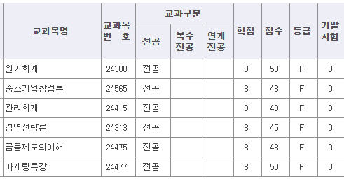

# 방송통신대 경영학과 올 F 후기

### 방송통신대 경영학과 편입

주식투자를 위해 이것저것 닥치는 대로 읽고 익혔다. 하지만, 여전히 아주 기초적인 것조차 내가 모르고 있었다는 것을 깨닫게 되는 순간들이 종종 있었다. 투자 업계 근처에도 안 가본 아마추어고, 투자 관련 공부를 정식으로 해본 적이 없는 이공계 출신이라 어쩔 수 없었다.  

기본적인 개념을 한 번 쭉 정리해서 볼 수 있는 방법이 없을까 고민하다가, 기왕 기본적 분석으로 투자의 방향을 잡았으니 경영학이라는 학과의 커리큘럼을 한 번 밟아보고 싶었다.  

경영학 그딴 거 투자에 도움도 안 되고, 특히 방송통신대에서 배워봐야 뭣도 아니라는 그 수많은 의견들을 다 개무시하고, 일단 2022년 2학기부터 방송통신대학교 경영학과에 편입을 하여 공부를 이어나가고 있다.  

어쨌든 굉장히 만족스럽다. 이에 관해서는 다음에 따로 글을 써서 설명하기로..  

### 세 번째 학기는 올 F

갑자기 미친 듯이 바빠져서 공부를 하나도 안 한 건 어쩔 수 없었다.  

그래도 중간 과제는 어떻게 제출할 수 있었다. 언젠가 하루 정도 잠을 1 시간만 자고 새벽에 네 과목에 대한 중간 과제를 미친 듯이 마무리해서 늦게나마 제출할 수 있었다.  

출석 수업은 다행히 Zoom 수업이었다. 줌 강의는 일하는 중에 켜놓기만 하고, 역시나 새벽에 과제를 대충해서 제출할 수 있었다.  

그런데 기말시험 시작 전날에 해외에서 바이어가 갑자기 들이닥쳤다.  

기말시험을 못 봤으니, 100점 만점에 50점을 차지하는 기말시험 점수가 0점으로 확정되었다. 50점 이하면 F니, 올 F가 확정된 것이다.  

괜히 미련이 남아서, 영상 강의를 2배속으로 싹 다 켜놓기만 하여 형성평가 점수는 20점으로 맞추어 놓았으나, 물론 아무 의미가 없다.  

결국 2023년 2학기는 전 과목 F로 마무리되었다.  

### 기말 미응시는 F

방송통신대학교에서 한 과목의 총점은 100점이고, 그중에서 기말시험이 차지하는 점수는 50점이다.  

과목 점수가 50점 이하면 F니, 기말을 못 보면 무조건 F다.  

기말을 봅시다.  

---
*원문 출처: [https://blog.naver.com/flionte/223318252931](https://blog.naver.com/flionte/223318252931)*
