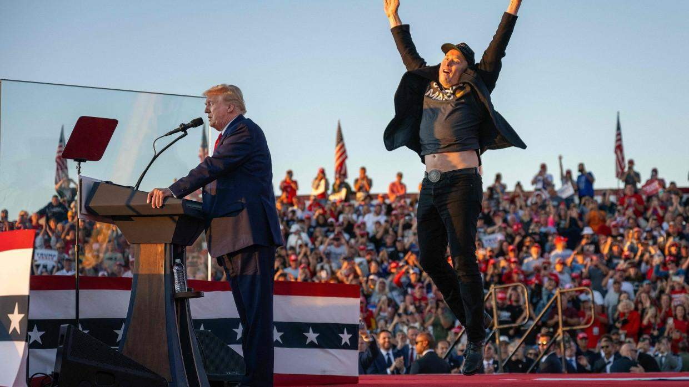

# 일론 머스크, 트럼프 베팅도 성공하나

주식 투자를 하는 사람이라면 테슬라를 무시하기 쉽지 않다. 개인적으로는 단 한 주도 매수한 적이 없고, 앞으로도 절대 투자할 생각은 없지만, 어쨌든 테슬라에 대해서는 항상 주의 깊게 살펴본다. 그리고 테슬라의 거의 전부라고 할 수 있는 일론 머스크에 대해서도 어쨌든 항상 주의 깊게 살펴보고 있다.  

일론 머스크는 말도 안 되는 확률에 자신의 모든 것을 베팅해 늘 승리해왔다. 그런 위험천만한 경영 방식은 성공하지 못하는 것이 순리겠지만, 어쨌든 일론 머스크는 언제나 승리했다. 순리에 베팅한 공매도자들은 모두 그 명성에 먹칠을 하며 퇴장 당했다.  

이번 10월에는 월터 아이작슨이 쓴 일론 머스크 평전을 읽었다. 제정신이 아닌 인간이라는 건 알고 있었지만, 책을 읽으면 읽을수록 일론 머스크라는 인간이 대체 무슨 인간인지 이해할 수가 없었다.  

보통 사람은 감당할 수 없는 부를 이미 가진 사람이 자신의 모든 것을 또다시 베팅한다. 거기서 승리하여 더 큰 부를 얻고 나서는 자신의 모든 것을 걸고 또다시 베팅한다. 그리고 다시 승리한다. 그리고 다시 베팅한다.  

대체 뭘까? 일론 머스크가 경영하는 기업에는 절대로 투자하지 않겠다는 생각은 더욱 확고해졌다.  

그런데 이번엔 이 인간이 갑자기 정치에 올인하기 시작했다. '갑자기'는 아닌가?  

세계 최고의 부호가 정치에 노골적으로, 그것도 아주 강경하게 입장을 드러내는 건 리스크가 너무 크다. 게다가 그가 운영하는 테슬라, 스페이스X, X는 모두 정치 권력의 결정에 크게 영향을 받는다. 물론 미국이라는 나라가 한국의 경우처럼 정치권력이 노골적으로 기업가에게 목줄을 채우고 마음대로 할 수 있는 건 아니지만..  

하지만 어쨌든 일론 머스크는 또다시 풀베팅.  

그리고 개표 중인 2024년 11월 6일 오후(한국 시간)인 지금, 트럼프의 당선이 거의 확실해보인다. 그는 또다시 베팅에 성공했다.  

나 같은 범부로서는 도저히 이해할 수 없는 행보이다. 그래서 내가 범부이고 그는 일론 머스크인 걸까?  

---
*원문 출처: [https://blog.naver.com/flionte/223649464663](https://blog.naver.com/flionte/223649464663)*
