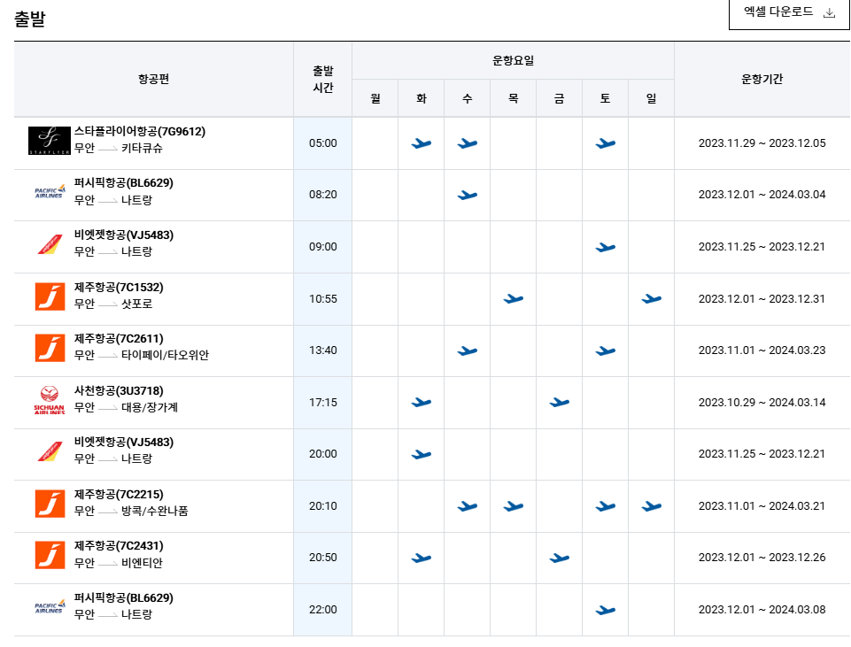

# 무안공항으로 떠났던 여행, 잘못된 소문들

### 무안국제공항

무안공항을 통해 내가 동생과 함께 대만 여행을 다녀온 게 12월 초였다. 불과 3주 전이다.  

군공항 이전과 관련한 광주와 무안의 분쟁으로 인해, 무안국제공항은 정상적으로 운영되지 않고 있었다. 그게 10년이 넘었다.  

대체로 여행사를 통한 전세기 이용만이 가능했고, 가끔 여행사에서 판매하지 못한 좌석이 특가 항공권으로 나오면 그걸 통해서나 이용할 수 있었던 게 무안국제공항이었다.  

결국, 전라도민들은 비행기로 1시간 걸리는 일본에 가려면 4시간 30분 걸려서 인천공항으로 가야 하는 어처구니없는 환경이었던 것이다.  

비행기로 1시간 거리인 후쿠오카에 가려면, 인천공항까지 차타고 4시간 30분, 돌아오는 데 다시 차 타고 4시간 30분이 소모되는 환장할 상황.  

금년 말에는 드디어 광주와 무안 사이에 무슨 물밑 합의라도 있었는지, 여행사를 통해서가 아니라 항공사의 직접 판매를 통해서도 무안공항을 이용할 수 있게 되었다.  

### 12월 2일의 무안국제공항

12월 2일에 무안에서 출국하여 12월 7일에 무안을 통해 다시 입국하는 대만 여행편으로 여행을 떠나게 되었다.  

텅 빈 공항, 방치되어 있는 수많은 공사 시설들, 열지도 않은 환전 은행, 인천공항의 능숙함과 대비되는 여러 느릿느릿한 절차들에 당시에는 오히려 마냥 즐거웠었다.  

그리고 몇 주 후, 끔찍한 사고가 발생하였다.  

돌이켜 보면 아찔하다. 참사는 생각보다 우리 가까이에 있다.  

### 잘못된 소문들

떠돌고 있는 잘못된 소문 중에 하나를 바로잡고 싶다.  

원래 무안공항에는 국제선이 운행되지 않았지만, 어딘가에서 무리하게 국제선 취항을 강행 후 12월 7일에  허가를 내줘서 12월 8일부터 국제선이 재개되었다는 잘못된 소문이 있다.  

기사 하나에서 시작된 것 같은데, 그 후로 많은 사람이 이를 검증없이 믿고 있는 것 같다.  

우선, 내가 직접 12월 2일에 무안공항에서 대만으로 가는 항공편에 탑승하였다. 12월 7일에 다시 대만에서 무안공항으로 돌아왔다. 12월 8일이면, 이미 내가 무안공항을 통해 해외여행을 다녀온 뒤다.  

*내 항공권 정보*

애초에 무안공항은 '무안국제공항'이다.  

사고가 난 해당 무안-태국 정기 항공편이 12월 8일부터 취항했다는 사실이 와전된 듯하다.  

정확히 말하자면, 2024년 12월부터 무안국제공항의 개항 이후 처음으로 '매일 국제선 정기편'이 취항한 것이다. 그것도 날짜가 12월 8일부터가 아니라 12월 2일부터다.  

*2023년 말, 무안항공 출국 일정표*

의외로 무안공항은 코로나 시국을 제외하고는 항상 국제선이 운영되고 있었다. 무안과 광주 사이의 군공항 관련 분쟁으로 인해 대규모의 정규 취항이 이루어질 수 없었을 뿐이다. 주로 여행사를 통한 패키지 여행 수요를 담당하는 전세기 위주로 임시 취항이 항상 이루어지고 있었다.  

다만, 그 취항 규모가 너무나 처참하여 흑자 공항이던 광주국제공항의 기능을 이전한 것임에도 국내 최악의 적자 공항으로 파행 운영되는 것이 문제였을 뿐.  

### 소문들

사고의 원인에 대한 논쟁이 심화되고 있다.  

애도와는 별개로 사고의 원인에 대해서는 그 어떤 성역도 없는 철저한 조사가 필요할 것이다.  

그 과정에서 여러 음모론도 각종 잘못된 정보들도 나올 테지만, 사회적 토론을 통해 결국 우리는 올바른 결론에 도달할 것이라 믿는다.  

### 추모의 마음을 담아

불과 얼마 전, 무안공항을 통해 설레는 마음으로 여행을 떠났고 다시 돌아왔던 기억이 아직도 생생한데, 같은 공간에서 이런 비극이 발생했다는 사실이 믿기지 않습니다.  

유가족분들께 깊은 위로의 마음을 전합니다.  

---
*원문 출처: [https://blog.naver.com/flionte/223710803260](https://blog.naver.com/flionte/223710803260)*
