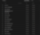
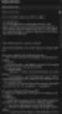
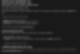
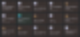
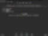
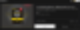
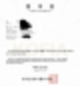
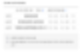

# 투자자산운용사 AI - Anki 활용 독학 합격 후기 (제44회)

## 투자자산운용사 취득

앞으로 평생 절대로 자격증이나 고시류의 시험은 보지 않겠다고 다짐했던 적이 있다.

하지만 회사의 요구로 어쩔 수 없이 이렇게 응시를 하게 되었다.

## 베이스

방송통신대 경영학과 졸업
전적 대학교에서 경제학원론1, 경제학원론2, 미시경제학, 거시경제학 이수
고시 공부하며 경제학 공부
개인 투자자 경력 (주식 현물 롱 포지션만 경험)

## 공부 기간

인터넷에 들어가보니 노베이스에 초단기 합격한 사람들이 많아서 쉽게 생각했다가 정말 큰일날 뻔 했다. 세상엔 똑똑한 사람들이 참 많나보다.

2025년 11월 초에 공부 시작하여, 2026년 1월 18일에 시험을 보고, 2026년 1월 29일에 결과를 확인했다.

대략 2달 조금 넘게 공부를 한 것.

## 교재

투자
자산운용사 빈출 암기 목록 pdf
: 인터넷에서 "투자자산운용사 빈출 암기 목록"을 다운 받았다. 대략 700개 항목.
: 이를 AI에 학습시켜서, 그를 기반으로 이해 및 암기.

패스코드
:
밀리의서재에서 "패스코드" 교재 학습. 2년 전 교재라서 개정된 사항들 때문에 엄청 고생.

## 학습 방법

투운사 시험의 8할은 암기다. 나는 암기력이 매우 부족한 편이고, 목디스크 때문에 종이책을 오래 볼 수도 없는 상황이었다.

그래서 AI, Anki 프로그램 등을 적극 활용했다.

1. "투자자산운용사 빈출 암기 목록"을 다운로드
우선 주요 빈출 내용들에 대한 암기부터 시작하기 위해서 인터넷에서 해당 pdf파일을 다운 받았다.
대략 700여개의 목록.

출처가 정확히 기억이 안 나는데 무슨 네이버 블로그였던 것 같다.

2. AI 활용
생소한 암기 목록 700개를 다짜고짜 외우는 건 거의 불가능했다. 용어부터 너무 생소했다. "제척기간"이라는 단어를 보자마자 머리가 멍해졌다. 그래서 다음과 같이 학습을 진행했다.

자료 학습
: AI에 "투자자산운용사 빈출 암기 목록" pdf의 내용을 학습시킴.
콘텐츠 생성
: AI에게 해당 내용을 기반으로 주제별 브리핑, 심화 강의 자료, 요약 슬라이드 자료, 이동 중에 들을 수 있는 팟캐스트를 만들게 함.
심화 학습
: 어려운 내용은 AI와 계속 대화를 주고 받으면서 이해.

*ai studio 목록*

*강의자료 생성 프롬프트의 일부*

*ai 학습 자료의 일부*

*노트북 LM*

*노트북LM에서 슬라이드 자료, 팟캐스트 생성*

*노트북LM이 생성한 슬라이드*

3. Anki로 뇌에 강제 주입
암기해야할 내용이 너무나 많았고, 대부분이 휘발성이 매우 강한 주제였다. 그래서 anki 앱을 적극적으로 활용했다.

하도 안키를 써서 뇌에 강제로 때려박다보니 매일 밤마다 머리가 깨질듯이 아팠다.

덕분에 안키 카드 약 850개를 다 외웠다.

*anki 덱*

*anki 카드 예시*

4. 밀리의서재의 패스코드 교재 학습
패스코드 종이책을 직접 보는 건 목디스크 때문에 불가능했다.

패스코드 교재를 사서 이를 pdf로 다시 변환하기에는, 이때가 이미 시험 일주일 전이라서 시간이 촉박했다.

그래서 그냥 밀리의 서재에 있는 2,3년 전 버전의 패스코드 교재로 공부를 했다.

"투자자산운용사 빈출 암기 목록" pdf와 패스코드 모두 구버전이라서 세법이나 규정 등 개정 사항 때문에 고생을 엄청 했다. 가급적
반드시 최신판을 사서 공부
하는 게 맞다.

※ 다시 공부를 해야한다면,
1) 반드시 최신 교재를 사서,
2) 그 교재를 pdf로 변환해서,
3) 그걸 기반으로 ai와 anki를 활용하여,
공부를 할 것이다.

*밀리의서재*

## 공부 일지

11월 초
: '이 기회에 미숙했던 회계 공부를 다시 해야겠다'는 생각에 틈틈이 회계 원론부터 복습 시작.

11월 말
: 회계는 시험 과목에 없다는 것을 발견함. 이때 너무 화가 나서 술을 좀 많이 마심.
: 공부 계획 수립: '투자론에 관한 부분은 이미 거의 다 알고 있으니, 우선 내가 모르는 각종 암기사항부터 암기 하자'

12월 첫째 주
: "투자자산운용사 빈출 암기 사항"이라는 pdf 자료를 다운 받아서 다짜고짜 암기 시작함. 대략 700여개의 항목.
: 평소부터 암기력이 매우 부족하고, 각종 용어부터 너무 생소해서 엄두가 안 남.

12월 둘째 주
: AI에 빈출 암기 목록을 학습시서, 주제별로 해당 내용에 대한 브리핑, 세부 강의, 슬라이드 자료, 팟캐스트, anki 덱 등을 생성하게 하여 학습 시작함.

1월 4일 (일)
: 마침내 "투자자산운용사 빈출 암기 사항" 자료의 이해 및 암기 완료.
: 근데 해당 자료가 몇년 전 자료라서 개정 사항들이 좀 많다는 것을 발견. 나름대로 수정사항을 반영했는데도 여전히 많았음.
: AI의 도움으로 최신 개정 사항을 반영하여 수정 암기 시작

1월 11일 (일)
: 수정 사항까지 암기 완료.
: 그 유명한 "패스코드" 교재를 사려고 했으나, 배송 및 주문, 교재를 pdf로 변환하는 시간 등을 고려하니, 고민이 됨. (목디스크가 심해서 일반 종이책으로는 학습이 매우 어려움)
: '밀리의서재'에서 2024년 시험 대비용(2023년 버전)을 발견. 교재를 대충 훑어봄.

1월 12일 (월)
: 패스코드 강의노트 1회차 학습 시작.
: 사실 이미 공부를 다 마쳤다고 생각해서 마음 편하게 공부 시작함.
:
100문항 중에 풀 수 있는 문제가 거의 없다는 것을 발견
함. 절망함.
: 잘 알고 있다고 생각했던 투자 이론 분야에서도 거의 맞히는 문제가 없었음.
: 베이스가 없던 기술적 분석 부분은 그냥 읽어보기만 하고 포기하기로 결정.

1월 13일 (화)
: 하루종일 풀타임으로 공부 시작.
: 전날 시작한 강의노트 1회차의 이해 및 암기 과정이 여전히 끝나지 않음.

1월 14일 (수)
: 마침내 강의노트 1회차의 이해 및 암기 과정 끝.
: 블랙 숄즈 방정식에 대한 이해가 조금 부족한 거 같아서 심화 학습.
: 블랙 숄즈 방정식은 그 구조가 열전달 방정식과 거의 비슷해서 쉽다고 생각했는데, 갑자기 이토 보조정리니 뭐니 어려운 내용이 튀어나와서 포기.

1월 15일 (목)
: 강의노트 2회차 학습 시작.
: 여전히 풀 수 있는 게 거의 없음.
: 하루종일 공부하다가 저녁 시간이 다 돼서야 2회차의 이해 및 암기 끝.
: 꼴받아서 저녁에 술 마시러 나감

1월 16일 (금)
: 강의노트 3회차 학습 시작. 갑자기 쉽게 느껴짐.
: 저녁에 모의고사 1회차 풀이. 여전히 모르는 게 많은데 점수는 84점.

1월 17일 (토)
: 오전에 모의고사 2회차 풀이. 점점 더 쉽게 느껴짐. 점수는 84점.
: 점심 식사 후 시험장이 있는 대전으로 이동.
: 대전에 도착하자,1주 동안의 집중 학습과, 부족한 암기력을 벌충하기 위해 anki로 뇌에 강제로 암기 사항을 때려박은 것과 장기간 운전으로 인하여 브레인 포그가 심해서 한동안 휴식함.
: 저녁 8시부터 지금까지 모아놓은 anki 덱을 모조리 복습
: 저녁 11시, 모의고사 3회차 풀이. 점점 더 쉽게 느껴짐. 점수는 3연속으로 똑같이 84점.

1월 18일 (일)
: 시험장에 미리 도착하여 그냥 머리 안 쓰고 멍하게 있다가 시험 침.
: 세법, 협회 규정, 기술적 분석 등에서 모르는 내용들이 좀 있어서 찍음.
: 패스코드 교재에 비하면 매우 쉽게 느껴짐

1월 29일 (목)
합격

*투자자산운용사 합격증*

*투자자산운용사 점수*

패스코드 교재는 죽고 싶을 정도로 어려웠는데 84점을 맞고, 막상 시험은 아주 쉽게 느껴졌는데 분야마다 골고루도 틀려서 81점을 받았다.

## 합격 발표 전 미리 합격 확인하는 팁??

투자자산운용사를 취득한 사람은 "파생개인투자 교육 면제"를 받게 된다.

따라서, 합격자 발표 시간인 10시 전에,
"파생개인투자 교육 면제증 출력"
메뉴를 눌러서, 자신이 파생개인투자 교육 면제자인지를 확인하면, 합격 여부를 미리 확인할 수 있다.

나도 오전에 미리 들어가서 해당 메뉴를 클릭해보았다. 그런데 "면제 대상자가 아니"라고 나왔다. 불합격한 것이다. 이번에 취득 못하면 큰일나는 상황이라 정말 끔찍한 기분이었다.

그런데 웬걸? 10시에 들어가서 보니 멀쩡하게 잘만 합격해있었다.

알고보니, 내가 2022년에 이미 파생개인투자 교육을 받았던 것. 이미 교육을 받았으니 당연히 "교육 면제자"가 아니었던 것이다. 정말 철렁했던 순간이다.

## 만약 시험을 다시 본다면?

반드시 패스코드 교재를 새로 살 것.
교재를 pdf로 바꿔서, 빈출 암기 사항 부분을 ai 학습 시켜서 anki덱을 만들어서 암기할 것
교재를 여러번 회독할 것.

## "투자자산운용사"라는 자격증

당연하게도, 이 자격증을 취득한다고 해서 투자운용능력이 좋아지는 것은 전혀 아니다.

투자업계의 신입사원 교육을 자격증으로 외주 줬다는 느낌이 강하다.

자격증 공부에서 요구하는 투자 이론이나 운용 전략 등이 내겐 별 의미가 없었다.

오히려 세법과 각종 법률 및 규정 등에 대하여 공부할 수 있었던 게 가장 유의미한 성과였다.

주식투자에서 주식의 증권으로서의 성질보다는 기업의 분할된 소유권이라는 점에 집중한다는 핑계로, 내게는 자본시장의 룰에 대한 지식이 거의 없었으니까. 그 부분을 보완할 수 있는 좋은 기회였다.

## 얻은 것

투자자산운용사 자격
세법, 각종 법률 및 규정 등에 대한 지식

## 얻지 못한 것

엄청난 주식 투자 능력

---
*원문 출처: [https://blog.naver.com/flionte/224166602255](https://blog.naver.com/flionte/224166602255)*
