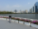

# 방콕 여행기 2026, 0장

## # 도망친 낙원

도망치듯 떠나고 싶은 남쪽 나라라는 그 흔한 모티프. 지독하게 오래도 살아남은 문화적 원형에는 무턱대고 느낌 그 자체로 들이닥치는 호소력이 있다. 절실히 실감했다.
그렇다면 남쪽 나라 사람들은 어디로 떠나야 할까? 이 또한 내 머릿속에 떠올렸다는 사실에 수치심이 들 정도로 흔해빠진 이야기지만, 떨쳐내기 힘들었다.
야자수, 습한 더위, 교통 체증, 자유분방한 옷차림, 온갖 사람들….

## # 여행이라는 것

일상으로부터의 단절이 그토록 필요하다면 근처 절간에 들어가도 되고 산골 펜션에 들어가 있어도 된다. 왜 하필 해외여행을 가겠다고 하는가?
낯선 기후, 낯선 음식, 낯선 사람들, 낯선 언어, 낯선 냄새, 낯선 시차, 낯선 옷차림, 낯선 분위기, 그 모든 것들이 새로운 자극으로서 기존의 나를 쓸어내린다.
산골에 들어가 봐야 나는 변하는 게 없다. 항상 읽던 것을 읽고, 항상 생각하던 것들을 생각한다. 산골에 있든 집에 있든 나의 내면은 거의 차이가 없다.
미친듯이 몰두하던 어떤 것들이 덧없게만 느껴지는 곳. 거기선 내게 들러붙어 있던 많은 무의미한 것들을 덜어낼 수 있다.

## # 한국인이 없는 방콕

방콕에는 한국인들이 드럽게 많다고 들었다. 특히, 내가 머물렀던 아속 지역은 특히 그렇다고 한다.
그런데 막상 도착하니 한국인들은 정말로 찾아보기 힘들었다. 3일차에는 정말 단 한 명도 발견하지 못했다.
좀 찾아보니, 최근 인터넷에 태국 여행에 대한 부정적인 이야기들이 굉장히 많이 떠돌고 있었다. 물가, 치안, ‘태국이 망했다’는 등의 이야기. 좀 제대로 알아보기 위해 카페의 야외 테라스에 앉아 이것저것 찾아봤다.
역시나 허황된 이야기였다.

하긴, 인터넷의 이야기에 따르면, 망하고 있지 않은 나라가 도대체 어디에 있을까? 한국도 망해가고, 독일도 망해가고, 미국도 망해가고, 일본도 망해가고, 프랑스도 망해가고, 중국도 망해가고, 영국도 망해가고.
태국은 안 망하곤 배길 수가 없겠다.
그래도 덕분에 한국인을 거의 찾아볼 수 없어서 해외여행 분위기가 제대로 났고, 이것저것 찾아보고 생각하던 그 테라스에서의 풍경은 좋았다.
내게 들이닥치고 있는 일상의 끔찍함, 태국이 망해가고 있다며 소리치고 있는 한국의 여론, 무관하게 따스한 햇살. 영화 ‘소나티네’ 생각이 많이 났다.

## # 첫

처음 겪어보기 전에도 그것에 대해 내가 가지고 있는 이미지가 있다.
2023년 생에 첫 해외여행으로 일본에 가서, 정말로 깜짝 놀랐다. 내가 가지고 있던 일본에 대한 그 많은 것들이 편견에 불과하다는 걸 깨닫곤 깜짝 놀랐다. 매번 그랬다.

이번 태국 여행도 마찬가지였다.
공항에서 허겁지겁 겨우 잡아서 탄 택시에서 호텔로 향하는 그 1시간도 안 되던 짧은 여정에서부터, 창밖으로 바라보던 하나하나가 얼마나 예기치 않던 것이었는지. 태국의 운전 습관이 그토록 정제됐을 줄을 전혀 몰랐다. 그 끔찍한 교통 체증 속에서도 경적 소리 한 번 들을 수 없었다.
고작 일주일 동안 경험한 방콕.
인터넷에서 내게 미리 알려준 방콕이란 그 얼마나 편향된 것이었던지.

## # 방콕의 해방감

방콕에서는 해방감을 느낀다. 해외여행을 떠나면 언제나 느껴지는 그런 해방감과는 완연히 다른 수준의 해방감이다.
방콕을 찾아오는 누구나 그런 해방감을 느낀다고 한다.
이유가 뭘까. 남쪽 나라의 기후? 친절하고 여유로운 사람들? 다양한 나라에서 몰려드는 수많은 외국인들이 만들어내는 불협화음? 온갖 극단이 온통 뒤섞여서 “평균”을 추구하기 어려워서? 눈치를 보지도 눈치를 주지도 않는 환경에서 느끼는 편안함?
이곳에서 해방을 느낀다면, 원래 살던 곳은 도대체 뭐란 말인가?
마이 뺀 라이.
오로지 개인으로서의 삶. 꼭 태국일 필요가 없을지도 모른다.

## # 여론이라는 굴레

우리는 사회적 동물로서 다른 사람들과 연결되어 일체감을 통해 행복을 느끼며, 거기엔 일종의 위대함도 있다는 것을 부정할 순 없다. 하지만 그 연결은 때로 그 이상의 불행을 가져다주기도 한다.
타인의 시선과 타인의 의견을 크게 걱정할 필요가 없다는 것. 이는 시장경제의 비인격성, 그리고 자유민주주의 체제에서 법치의 보호라는 이중의 안전장치 속에서만 허락되는 지독하게 현대적이고 예외적인 특권이다.
우리는 동네 사람들이 나를 미워한다고 해서, 혹은 유력가가 나를 미워한다고 해서 걱정할 필요가 전혀 없다. 그들은 우리를 무리에서 추방하여 텅 빈 초원으로 내몰 수도 없고, 멍석말이로 죽여버릴 수도 없다.
설령 내 모든 이웃들이 나를 증오한다고 해도 심지어 대통령이 나를 미워한다고 해도 내 인생에는 좆도 상관이 없다.
이는 인류 역사상 정말로 최근에 발명된 극히 예외적인 상황이다.
우리는 스스로 생각하고 판단하면서도 생존의 위협을 느낄 필요가 없는 특권 속에 살고 있다.
스스로 그 특권을 놓아버릴 필요는 없다.

## # 귀국행 비행기에서

한국으로 돌아가는 비행기는 언제나 울적하다.
지난 방콕을 조금 더 붙잡아 보고자 이렇게 여행기를 써본다.
이번 여행기를 1부로 하여, 구체적인 내용을 담아 2부로 이어나가려 했으나, 막상 다 적고보니 이것만으로도 충분할 것 같다.
김승옥의 "서울의 달빛 0장"처럼 말이다.
이 여행기를 이어서 쓰게 될까?
어떻게 될지 지켜보도록 하자. 한치 앞도 내다볼 수 없는, 내가 사랑하는 여행의 방식처럼 말이다.

---
*원문 출처: [https://blog.naver.com/flionte/224184032455](https://blog.naver.com/flionte/224184032455)*
