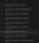
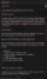
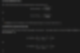
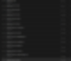
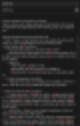
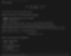
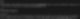
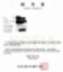
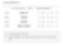

# 금융투자분석사 AI - Anki 활용 독학 합격 후기 (제 24회)

## 금융투자분석사 접수

금년 초에 44회 투자자산운용사 시험에 응시하여 취득을 하였다. 자격증 시험 같은 건 정말 넌더리가 날 정도로 싫었지만, 필요에 의해서 취득을 한 것이었다.

당시, 투자자산운용사 준비 과정에서 금융투자분석사라는 시험에 대해서도 알게 되었고, 어차피 시험 과목도 겹칠 테니 이왕이면 같이 따볼까 하는 생각에, 일단 시험 날짜와 접수 날짜를 알아봐서 캘린더에 기록을 해두었었다.

그렇게 까맣게 잊고 살았다.

6월 12일, 구글 캘린더의 알람으로 3일 뒤가 금융투자분석사 시험 접수일이라는 걸 알게 됐다. 부랴부랴 교재부터 검색해서 대충 괜찮아보이는 걸로 주문했다.

그토록 싫은 자격증 공부를 그렇게 또 시작하게 되었다. 심지어 이번엔 쓸데도 없는데도.

## 금융투자분석사 시험

총 4개 과목을 100분 동안 100문제를 푸는 객관식 4지 선다형 시험이다. 1문제당 1점.

합격 기준은 전 과목 60점 이상. 다만 과목별 40% 미만 득점 시 과락으로 불합격 처리된다.

과목별 세부 구성 및 출제 문항 수는 다음과 같다.

- 1과목: 증권분석의 기초(25문항)
- 2과목: 가치평가론(35문항)
- 3과목: 재무분석론(20문항)
- 4과목: 증권법규 및 직무윤리 (20문항)

투자자산운용사와 과목 구성과 이론적 베이스가 상당 부분 겹친다.

## 베이스

방송통신대 경영학과 졸업
전적 대학교에서 경제학원론1, 경제학원론2, 미시경제학, 거시경제학 이수
고시 공부하며 경제학 공부
개인 투자자 경력 (주식 현물 롱 포지션만 경험)
2026년에 44회 투자자산운용사 취득

## 공부 기간

6월 15일부터 시험일인 7월 12일 새벽까지.

7월 4일 토요일부터 시험일까지는 풀타임으로 하루종일 공부만 했다. 그러려고 노력했다.

4주 정도 했다.

## 교재

『2026 이패스 금융투자분석사 금융의 바이블 4주 Cut 핵심개념+문제풀이』
교재를 pdf 스캔하여, 각 단원별로 ai한테 먹여서 생성한 학습 자료
투자자산운용사 준비할 때 교재를 안 사서 고생을 많이 했다. 이번엔 교재부터 샀다. 돌이켜보면 참 잘했다.

## AI

주로 구글의 AI Studio를 활용했다. 모델은 gemini 3.1 pro. 여기서 프리뷰 자료, 본격 학습 자료, 안키 카드를 모두 생성했다. (일부 안키 카드는 직접 타이핑하여 앱에 입력하기도 했다)
그래프나 인터렉티브 폼이 필요할 때는 제미나이 웹을 활용했다. 모델은 3.1 pro.
검증용으로 클로드를 활용했다. 무료 사용자라서, 모델은 Sonnet 5.
시각화 자료가 많이, 자세히 필요할 때는, 구글 코랩에서 구현했다. 코드는 ai가 짰다.

## 학습 과정

베이스가 있기 때문에 학습이 그리 어렵지 않을 것이라 전망했다. 4과목인 증권법규 및 직무윤리 부분의 암기만 잘 하고 넘어가면 큰 문제가 없으리라고 여겼다.

학습 순서는 다음과 같았다.

1. 교재를 제본소에 맡겨서 pdf ocr 스캔
제본소에 2만원 주고 맡겼다.

2. 각 챕터를 ai에게 먹여서 프리뷰 자료 생성시켜서, 우선 전체 학습
각 챕터별로 ai에게 먹여서 프리뷰 자료를 만들고, 그걸 읽고, 모르는 건 크롬 사이드창의 제미나이에게 계속 물어보면서 이해하고, 마지막으로는 anki 카드를 생성하여 그걸 anki 앱에 등록하여 다 외웠다.
프리뷰 자료를 학습하는 데에 거의 모든 시간을 소모해버렸다.
알고 보니, 여기서 이미 공부를 깊게 다 해버렸던 것이다.
대략 3주를 소모했다.
매 챕터마다 안키 카드를 생성하여서, 암기를 했다.매 챕터별로 anki 카드가 20개에서 30개 정도는 나왔다.4과목은 훨씬 더 많이 나왔다.

3. 각 챕터를 ai에게 먹여서 본격 학습 설명 자료 생성시켜서 학습
프리뷰 자료 학습에서 이미 거의 공부를 다 마쳐버려서, 이 단계에서는 거의 할 게 없었다.
일단, 각 챕터별로 교재를 ai에게 먹여서 설명 자료를 만들고, 그걸 읽고, 모르는 건 크롬 사이드창의 제미나이에게 계속 물어가면서 이해하고, 마지막으로는 anki 카드를 생성하여 그걸 anki 앱에 등록하여 다 외웠다.
2일 정도 소모했다.
매 챕터마다 추가 anki 카드가 10개 정도는 나왔다. 4과목은 훨씬 더.

4. 교재 풀이
교재는 각 챕터별로 (1) 핵심정리문제와 그 아래의 이론 설명(수학의정석으로 치면 기본문제), (2) 출제예상문제(수학의정석으로 치면 단원별 연습문제)으로 구성되어 있다.
시험일이 2일, 3일 정도밖에 안 남아서 결국 다 못 풀었다.
1과목의 1장인 계량분석만 핵심정리문제와 출제예상문제를 다 풀었다. 나머지는 핵심정리문제만 풀었다.
매 챕터마다 anki 카드가 5개 정도는 나왔다. 4과목은 끝도 없이 계속 더 많이 나왔다.

5. 교재의 실전모의고사 풀이
교재에 총 4개의 실전모의고사가 달려있다.
시험 전날 3개의 모의고사를 풀었고, 그중 1개의 모의고사는 시간이 부족해서 풀기만 하고 정리를 못했다. 3개째의 모의고사를 다 풀고 채점하고 틀린 문제만 체크하니까 이미 시험 당일 새벽 3시였다.
마지막 1회분의 실전모의고사는 손도 못 댔다.
모의고사 1회마다 anki 카드가 20개 정도는 나왔다. 특히, 4과목에서 어마어마했다.

*(프리뷰 ai)*

*(프리뷰 자료 프롬프트)*

*(프리뷰 ai 내용)*

*(본격 학습 ai)*

*(본격 학습 자료 프롬프트)*

*(본격 학습 ai 내용. 프리뷰의 내용과 별반 차이가 없다.)*

*(anki 덱. 시험 끝나자마자 덱을 추출해서 저장.)*

*(anki 카드 예시)*

## 과목별 학습 난이도

1과목 증권분석의 기초
: 통계학, 경제학은 예전에 공부한 적이 있어서 학습하기에 그렇게 까다롭지 않았다. 통계에서 외울 게 좀 있었다.
2과목 가치평가론
: 파생결합증권에서 암기해야할 사항이 많았다. 나머지 주식, 채권, 선물, 옵션 부분은 거의 알고 있는 내용이었다.
3과목 재무분석론
: 까다로운 회계 규정 부분들이 있었지만, 대체로 어렵지 않았다.
4과목 증권법규 및 직무윤리
: 투자자산운용사 시험과 내용이 겹치지만 놀라울 정도로 다 잊었다. 가장 힘들었다.

## 시험 직전 준비 수준

1과목 증권분석의 기초, 2과목 가치평가론, 3과목 재무분석론
은 거의 준비가 됐다고 생각이 되었다. 2과목 가치평가론에서 파생결합증권 파트의 암기할 내용들을 못 외우긴 했지만 비중이 그리 높지 않으니까.
4과목 증권법규 및 직무윤리
는 아무리 외우고 아무리 anki 카드를 추가하고 아무리 공부해도 계속 모르는 게 끝도 없이 계속 나와서, 그냥 하늘에 맡기자는 마음이었다. 그래도 할 수 있는만큼은 최대한 외웠다.

## 시험일

마지막 며칠 동안 벼락치기 한다고 잠을 거의 못 잤다.
일어나자마자 커피를 들이붓고, 시험장 근처 공공 주차장에 주차해놓고 시험장으로 걸어가는 길에 에너지드링크도 2캔 마셨는데도, 너무 졸려서 정신을 차릴 수가 없었다. 걸어가는 내내 눈꺼풀이 감겨서 전력 질주도 해봤지만 괜히 땀만 났다.
원래 시험장에 미리 가서 안키 덱 돌리면서 마지막 암기하려고 했는데, 결국 못 하고 내내 산책만 하다가 시험을 봤다.

## 체감 난이도

1과목 증권분석의 기초
: 평이했다.
2과목 가치평가론
: 파생결합증권 쪽에서 헷갈리는 게 몇 개 있었다. 아예 모르는 게 하나 있었다. 그 외엔 평이했다.
3과목 재무분석론
: 평이했다.
4과목 증권법규 및 직무윤리
: 하늘에 맡겼다.

## 시험 결과

*(합격증)*

*(점수)*

무난하게 합격했다.

1,2,3 과목은 생각대로 나왔고, 4과목은 생각보다 너무 잘 봤다.

## 합격 후기

쓸 일도 없는 자격증을 대체 왜 공부하고 있을까, 하는 생각이 공부하다가 자주 들었다.
쓸 일도 없는 자격증을 대체 왜 땄을까, 하는 생각이 지금도 든다.

## 얻은 것

금융투자분석사 자격

## 얻지 못한 것

엄청난 주식 투자 능력

---
*원문 출처: [https://blog.naver.com/flionte/224355997209](https://blog.naver.com/flionte/224355997209)*
