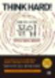

# &quot;몰입&quot;, 지적 몰입의 테크닉

황농문 교수가 쓴 "몰입"을 읽었다.

그냥 몰입 잘하는 법에 대해 설명해주는 책이라고 생각하고 이 책을 읽기 시작하면 분명 당황할 것이다.

어떤 것에 몰입을 하는 테크닉이라는 것들은 인터넷을 통해 이미 무수히 많이 알려져있다. 외부 자극을 멀리하고, 단기적인 자극 및 보상을 제공하는 각종 매체들을 멀리하고, 규칙적인 패턴으로 생활하고, 찬물 샤워나 운동 같은 약간의 육체적 고행을 하고.. 결국 도파민에 대해 다루는 그런 이야기 말이다.

이 책은 거기서 멈추지 않는다.

어떻게 하면 몰입 상태에 도달할 수 있으며, 그러한 몰입 상태에서 어떠한 성취를 이룰 수 있는지에 대해 다루고, 그걸 직접 경험한 사람들의 수기들을 제시한다.

신앙 체험 간증이라고 해야할까. 좀 어리둥절할 정도다.

무언가에 한없이 몰입하여 살아가는 삶을 추종하는 이들이라면 한 번쯤 접해봐도 괜찮을 책. 그냥 슬슬 읽으면 되는 책이라 부담감도 없다.

---
*원문 출처: [https://blog.naver.com/flionte/223264311467](https://blog.naver.com/flionte/223264311467)*
