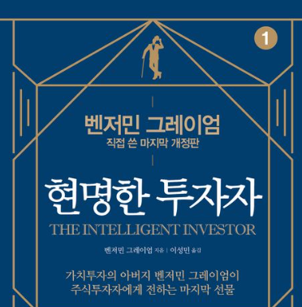

# "현명한 투자자", 가치투자의 고전

주식투자를 하는 사람이라면 누구나 들어봤지만 막상 읽어본 사람은 거의 없는 책, 벤자민 그레이엄의 '현명한 투자자' 이야기다.  

'미스터마켓'과 '안전마진'의 개념을 제시한 전설적인 고전이지만, 이 책을 읽지 않을 이유는 너무나 많다.  

이 책이 이렇게 유명해진 것은 아마도 거의 워렌 버핏 때문일 텐데, 그도 벤 그레이엄의 투자법을 맹목적으로 추종하지는 않는다. 그레이엄의 투자법은 아주 엄격한 양적 분석 방식이다. 버핏은 이미 그레이엄의 회사에서 근무할 때부터 그레이엄의 투자법에 대해 약간의 이견이 존재하였으며, 찰리 멍거의 영향으로 초창기 담배꽁초 투자법에서 벗어나 상당한 질적 분석 방식을 사용하게 된 이후부터는, 버핏의 투자법은 이 책과는 상당한 거리가 생겼다고 볼 수 있을 것이다.  

너무 오래됐다. 투자의 세계에서는 설령 어떤 투자 방식이 초과 수익을 얻는 확실한 방법이라고 할지라도 그 투자법이 널리 알려지고 많이 사용되면 이내 그 효용을 잃어버린다. 워렌 버핏도 젊었던 시절 자신의 투자관이 알려지지 않기 위해 나름대로 최선을 다 했다고 한다(그리고 가치투자란 사람들에게 아무리 설명을 해도 사람들은 그 방식을 좋아하지 않고 따라하지도 않으며, 마치 타고난 것처럼 어떤 사람은 적게 말해도 바로 받아들이고 어떤 사람을 아무리 설명을 해도 받아들이지 못한다는 것을 깨달았다고 하며, 결국 우리가 아는 버핏처럼 자신의 투자법을 널리 알려주는 친절한 구루가 되었다). 1949년에 초판이 발간되었으니 대체 얼마나 구닥다리 방식일지 감도 안 잡힌다. 버핏의 투자법도 구닥다리라는 소리를 듣는데, 버핏에게도 구닥다리인 방식이라니.  

다른 좋은 책이 많다. 사실 정말 많다. 대표적으로 피터 린치의 세 가지 저작만 해도 정말 좋은 책이고, 피터 린치의 글솜씨가 워낙 빼어나서 읽는 것도 즐겁다. 내용도 알차다.  

책이 좀 두껍다. 책을 읽기 싫게 만드는 아주 현실적인 이유다.  

그럼에도 불구하고, '현명한 투자자'라는 책은 너무나도 정말 너무나도 좋은 책이다. 그리고 이 책이 왜 좋은 책인지, 그리고 얼마나 강력한 투자관을 서술하고 있는지는 버핏이 "The superinvestors of graham and doddsville"에서 잘 설명을 해놓았다.  

https://www8.gsb.columbia.edu/sites/valueinvesting/files/files/Buffett1984.pdf  

간단하게 요약해보자면 다음과 같다.  

전국민에게 주사위를 던져서 나오는 숫자를 맞히기 대회를 개최한다고 가정해보자. 주사위를 1번 던지고 나면, 전국민의 1/6은 "순전히 운으로" 그 숫자를 맞힐 것이다. 2번 던지면 전 국민의 1/36이 "순전히 운으로"그 숫자를 맞힐 것이다. 6번을 던지고 나면 어떻게 될까? 전 국민의 대략 1/50000인 대략 1000명 정도는 "순전히 운으로" 6번 연속으로 그 숫자를 맞힐 수 있을 테고, 그들은 이제 자신들이 무언가 비법이라도 있는 것처럼 자신의 실력에 대해 자신하게 될 테고, 그중 일부는 주사위 숫자를 맞히는 비법에 대해 인터뷰도 하고, 책도 내고, 추종자도 생길 것이다. 주사위를 10번 던졌을 때, 전 국민의 한 명 정도는 10번 연속으로 숫자를 맞히는 것에 성공할 테고, 그는 "주사위 숫자 맞히기 업계"에서 종교적으로 추앙받을 테고, 그의 숫자 맞히기 전략은 대대적으로 유행할 테고, 그의 전략을 통해서 부자가 될 꿈을 꾸는 사람들이 무수히 많이 생겨날 것이다. 하지만 그 모든 것은 아무 의미가 없고 그저 운일뿐이다.  

어떤 투자관의 성공이 저런 순전한 운이 아닌 실제 유효성에 의한 것이라고 어떻게 판단할 수 있을까? 버핏은 그레이엄의 투자관에 영향을 받은 여러 사람들의 투자 성과와 그들의 스토리를 제시한다. 살펴보면, 그들은 투자하는 기업들도 제각기 다르고, 투자하는 종목의 수도 제각기 다르고, 사는 지역도 제각기 다르고, 투자 규모도 제각기 다르다. 그들의 공통점은 아주 뛰어난 초과수익을 장기적으로 얻었다는 것, 그리고 벤자민 그레이엄의 투자관의 영향 아래에 있는 사람들이라는 것이었다. "투자법"이 제각기 다른 독립적인 사람들이, "투자관"을 공유하고 있다는 것 때문에 뛰어난 성과를 얻고 있었다는 것이다.  

그러므로 이 책의 가장 큰 의의는 아마도 그런 투자관에 대해 이해할 수 있게 해 준다는 점일 것이다.  

버핏은 자신이 투자를 하는 기간 동안 가치투자가 유행하는 것은 한 번도 본 적이 없었다고 한다. 이 책 또한 일부 사람들에게는 자신의 투자관을 만들어줄 테지만, 대부분의 사람들에게는 자신의 투자관 형성에 별 의미가 없을 수도 있다. 하지만 어떤 방식에 동의하든 동의하지 않든, 자신이 사용하든 사용하지 않든, 성공적으로 작동해 온 어떤 시스템에 대해서 이해해보려고 시도하는 것은 그렇게 무의미한 일은 아닐 것이다.  

---
*원문 출처: [https://blog.naver.com/flionte/223308126114](https://blog.naver.com/flionte/223308126114)*
