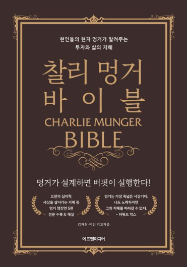

# "찰리 멍거 바이블" - 찰리 멍거 투자관의 집대성

찰리 멍거의 삶을 집대성한 책이라면 '가난한 찰리의 연감 (Poor Charlie's Almanack)' 일 것이다. 아쉽게도 그 책은 찰리 멍거가 허락을 하지 않아서 한국어 번역본이 출판되지 않고 있다.  

이 책은 '가난한 찰리의 연감'과 비슷한 형식을 취하고 있다. 찰리 멍거의 강연과 글을 모아두고, 사이사이에 다른 이들의 찰리에 대한 인터뷰와 찰리 멍거의 투자 실적들에 대해 다루고 있다.  

'가난한 찰리의 연감'에서 "노년 찬가" 부분과 같은 흥미가 떨어지는 부분은 덜어내고, 투자와 최대한 유사한 부분만을 담았으니 오히려 대부분의 독자들에게는 이 책이 더 읽기에 편할 수도 있겠다.  

## 찰리 멍거의 투자

찰리 멍거의 투자 스타일은 설명하자면 생각보다 간단하다.  

가격이 잘못 매겨지는 기회를 찾아 온갖 것들을 읽고 생각하며 아주 오랫동안 기다린다. 그리고 그 기회가 오면 그 누구보다 과감하게 배팅한다. 그리고 오랫동안 기다린다.  

읽다 보면 우리가 일반적으로 "주식 투자"와 직접적으로 관련되어 있다고 생각하는 요소들에 대한 설명은 정말 적다. 주가 차트에 대한 분석법도 없고, 그렇다고 재무분석에 대한 내용도 없다.  

대신, 이 책은 찰리 멍거의 그 단순한 투자 스타일을 구현하기 위해 찰리가 사용하는 방법론들에 대해 상세히 다룬다. 그의 학습 기계와 같은 측면, 심리학에 대한 깊은 이해, 기업의 경제학에 대한 탐구심, 엄청난 인내력, 다른 이들의 사회적 압력에 전혀 굴복하지 않는 강고한 심리적 독립성, 도박에 대한 흥미 등에 대해서 말이다.  

찰리 멍거의 표현은 워렌 버핏에 비해 훨씬 분명하고 훨씬 공격적이다. 그렇기 때문에 '워렌 버핏 바이블'을 읽을 때보다 훨씬 더 즐겁게 읽었던 것 같다.  

연말에 쉬면서 3번 정도 반복해서 읽었다. 정말 즐겁게 읽었다.  

투자 서적을 깔깔 웃으면서 읽을 수 있다는 게 얼마나 대단한 일인가. 오직 찰리 멍거에 대한 책이기에 가능한 마법과 같은 일이다.  

---
*원문 출처: [https://blog.naver.com/flionte/223310234727](https://blog.naver.com/flionte/223310234727)*
