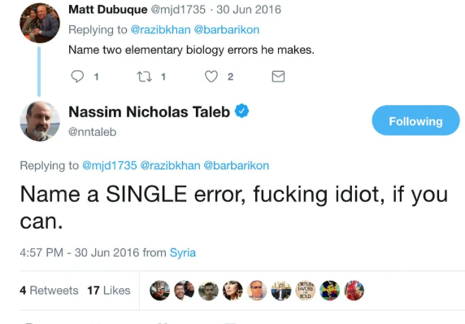

# 나심 탈레브의 "안티프래질"

저자의 5권의 책 중에서 가장 최근에 출판한 스킨 인 더 게임을 가장 먼저 읽었다. 그 후 가장 처음 출판된 행운에 속지 마라부터 시작하여 출판된 순서대로 블랙 스완, 블랙스완과 함께 가라를 읽었다. 그리고 마침내 4번째로 출시된 안티프래질을 끝으로 저자의 모든 책을 다 읽게 되었다.  

나의 생각과 너무나 비슷하면서도 나보다 훨씬 잘 쓴 글을 보면 화가 날 정도로 질투가 날 때가 있다. '왜 내가 먼저 이런 글을 쓰지 못했을까' 하는 생각. 나심 탈레브의 저작들이 그러했다.  

게다가 안티프래질은 저자가 자신의 정수를 담은 작품이라고 공언을 하였으니, 읽기 전에 얼마나 기대를 했는지 모른다.  

하지만, 저자가 쓴 5권 중에 이 작품이 개인적으로는 가장 별로였다. 작가주의에 심취한 어느 영화 감독이 어느날 폭주하여 균형을 잃고 자신의 일기장인지 작품인지 구분이 가지 않는 괴작을 출시해버린 느낌이 좀...  

*트위터에서 쌍욕을 날렸을 때 삶이 위험해진다면 "프래질"한 삶을 살고 있는 것이다*

주식 투자자라면 함께 할 수밖에 없는 불확실성과 우연에 대한 성찰을 얻고 싶어서 읽었다가, 어쩐지 개인적인 위로를 얻게 되어버린 나심 탈레브의 인세트로 시리즈였다.  

사회가 닦아놓은 길에서 자의로든 타의로든 벗어나버려 불확실성에 유독 크게 내던져진 생활을 살아가게 되어버린 사람들에겐 그 어떤 감성 에세이보다 위안이 되지 않을지.  

---
*원문 출처: [https://blog.naver.com/flionte/223373638339](https://blog.naver.com/flionte/223373638339)*
