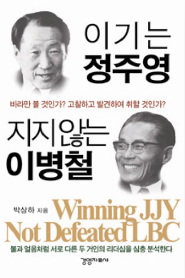

# "이기는 정주영, 지지 않는 이병철"

기업가들의 이야기는 언제나 흥미진진하다.  

그 기업가가 어떤 시대와 환경에서, 어떠한 시장 조건과 경쟁 상황에 있었는지를 면밀히 파악하고, 그러한 상황에서 그 기업가가 어떠한 선택을 하였으며, 그 선택의 근거는 무엇이었고, 그 선택이 어떤 성공과 어떤 실패를 초래하였는지에 대하여 고찰해볼 수 있는 기회가 된다.  

하지만, 이미 성공한 기업가의 과거를 백미러로 돌아보며, 그의 모든 것을 추앙하는 식의 이야기는 전혀 매력이 없다. 제프 베조스가 대머리라고 해서, 대머리를 찬양하는 건 좀 이상하지 않을까.  

투자자로서의 비판적이고 냉소적인 태도에서 잠시 벗어나, 정주영과 같은 무대포 정신을 한 번 가져보고 싶어서 펼쳐봤던 책. 결국은 절반도 채 읽지 못했다.  

그래도 어쨌든, 1세대 기업가들의 이야기에는 낭만이 있다.  

---
*원문 출처: [https://blog.naver.com/flionte/223398155628](https://blog.naver.com/flionte/223398155628)*
