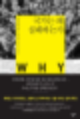

# 러시안 룰렛을 당기는 광인들, 그 틈에서 겁쟁이로 살아남기

## 러시안 룰렛

러시안 룰렛을 하는 대가로 얼마를 준다면 하겠는가.

합리적인 사람이라면 답은 정해져있다. 아무리 큰 돈을 준다고 해도 결코 응해선 안 된다. 여섯 번 중 다섯 번을 이겨도 소용이 없다. 단 한 번의 패배가 모든 것을, 심지어 '나'라는 인간의 실존마저 지워버리기 때문이다.

그런데도 기꺼이 방아쇠를 당기는 자들이 늘 있었다. 안타깝게도, 거기서 살아남은 소수가 결국 모든 것을 가져갔다. 인류 역사가 이 사실을 몇 번이고 증명해왔다.

위험 추구 성향이 병리적인 수준의 광인들.

그렇다면 나와 당신처럼, 죽어도 저 방아쇠에 손가락을 걸지 않을 사람들은 어떡하라는 말일까. 우리에게 남은 몫은, 저들이 세운 왕국에서 근면성실하게 일하며 부스러기를 받아먹는 것뿐일까.

이 질문에 답하려면,
대런 애쓰모글루
와
제임스 로빈슨
의
『국가는 왜 실패하는가』
를 통해, 인류가 지난 수천 년간 이 잔인한 게임을 어떤 식으로 운영해왔는지 들여다 볼 필요가 있다.

## 착취적 제도와 폭력 엘리트

인류사의 대부분 기간 동안, 한 사회가 만들어낸 잉여의 대부분은 그것을 생산한 사람이 아니라 그것을 지키거나 빼앗을 힘을 가진 자들에게 돌아갔다.

경제학자
맨서 올슨(Mancur Olson)
의 표현을 빌리자면, 초기 인류 사회의 도적떼가 매번 마을을 털고 떠나는 대신 아예 눌러앉아 매년 일정한 몫을 뜯어내기 시작한 것이 국가의 기원이었다. 한 번 자리를 잡은 폭력배들은 거기서 멈추지 않았다. 그들은 스스로를 왕족이니 귀족이니 사족이니 신성한 뼈니 푸른 피니 천손이니 해가며 착취적 제도를 공고화했다.

이 '
정주형 도적(stationary bandit)'
들은 역설적으로 자신이 지배하는 땅의 번영에 이해관계를 가지게 된다. 올슨은 이것이 국가와 통치, 나아가 왕조라는 개념의 기원이라고 설명한다.

오늘날 유럽의 웅장한 고성에서 우아하게 미술품을 수집하고 고상한 혈통을 자랑하는 왕족과 귀족들의 후예들, 그 우아한 가문의 뿌리를 따라 올라가보면 피비린내가 진동한다. 로마 제국의 폐허 위에서 칼을 휘두르며 토착민의 땅을 빼앗았던 게르만 우두머리들, 유럽 대륙의 해안가를 피로 물들이며 약탈을 일삼다 정착한 바이킹 우두머리들이 바로 그들의 조상이다.

'정복왕' 윌리엄과 그 무리들은 원주민의 토지를 강탈한 후, 가축 한 마리, 나무 한 그루, 연못 하나까지 샅샅이 훑어 수탈 장부에 적어 넣었던 지독한 정주형 도적떼였다. 유혈이 낭자한 전쟁터에서 가장 잔혹하게 폭력을 휘둘러 승리한 도적 우두머리들이 세월이 흘러 세련된 옷을 입고 공작과 백작의 칭호를 달았을 뿐이다.

한 고조를 초한전쟁의 승리로 이끌었던 소하의 그 전설적인 보급은 관중과 촉 지역 토착민들의 땀과 피, 그리고 목숨까지 '보급품'으로 환산해 쥐어짠 수탈이 있었기에 가능했다. 관중과 촉 지역의 대부분의 토착민은 유방과 항우의 다툼과는 아무런 상관없이 그저 밭 갈고 소 키우며 살아가던 이들이었다. 패현 풍읍의 동네 양아치들이 들고 일어나 마침내 위대한 제국을 창업한 영광 뒤에는 이렇게 이름없는 생산자들의 무자비한 희생이 깔려 있었다.

어쨌든 그들은 생명을 건 폭력이라는 극단의 위험을 자발적으로 감수했고, 살아남았다. 그 대가로, 국가 전체가 그들의 사유물이 되었다.

'착취적 제도(extractive institutions)'
의 핵심은 이 폭력 엘리트들이 정치적 권력과 경제적 기회를 독점하는 악순환의 폐쇄 회로다. 이들은 자신들이 저지른 강도질에 신성함과 정통성이라는 옷을 입혔다. 왕권신수설을 외치고, 촘촘한 신분제를 만들어 자신들의 지위를 대대손손 물려주었다. 정치 권력을 독점해 경제적 자원을 착취하고, 그 자원으로 다시 군대를 키워 권력을 지키는 악순환의 회로가 대물림되었다.

이런 폭력 엘리트가 되기 위한 러시안 룰렛에서 절대 다수의 사람들은 전장의 오물로 산화해버리고, 승리의 영광도 오래 가는 경우는 극도로 드물었다. 따라서, 합리적인 사람이라면 그 게임에 참여하기 보다는 매일의 일상을 위해 땅을 일구는 쪽을 택했을 것이다.

허나, 농사를 짓고, 가축을 치고, 물고기를 잡고, 옷감을 짜고, 광석을 캐던 절대다수의 생산자들은 근면성실하게 만들어낸 잉여의 대부분을 약탈적 정치 엘리트들에게 내어주어야 했다.

미친 룰렛을 당길 용기가 없다면, 평생 남의 왕조를 위해 근면성실하게 땅을 갈다 죽는 수밖에.

## 기적, 그리고 새로운 룰렛

폭력을 독점한 정치 엘리트들의 뿌리깊은 착취에 균열을 낸 것은
'포용적 제도(inclusive institutions)'
의 기적적인 등장이다. 사유재산권이 보장되고, 법 앞의 평등이 수립되며, 신분과 무관하게 누구나 경제 활동에 참여할 수 있는 길이 열렸다.

과거에는 오직 피를 흘려야만 엘리트를 대체할 수 있었지만, 이제는 참정권과 자유시장이라는 평화로운 길이 열린 것이다. 포용적 제도 덕분에, 옛 정주형 도적의 후예들은 더이상 성벽 뒤에서 대물림된 신분으로 버티지 못한다. 대신, 그들의 자리는 경제적 혁신이라는 새로운 형태의 힘을 휘두르는 자들에 의해, 그리고
창조적 파괴
에 의해 끊임없이 위협받는다.

그런데 이 창조적 파괴로부터 새로운 문제가 생긴다. 포용적 제도의 시대에서도 불평등의 근본적인 원리는 바뀌지 않았다. 자본주의라는 판에서 거대한 과실을 싹쓸이해가는 것은 언제나 위험을 극단적으로 짊어진 자들이다.

거대 기업을 일군 기업가나 지역 사회에서 상당한 규모의 자영업을 일군 이들은 물론이고, 엄청난 연봉의 프로 선수나 유명 연예인처럼 자기 자신이라는 사업을 운영하는 사람들까지, 즉 극단의 리스크를 짊어지는 사업가들 말이다.

물론, 룰렛의 판돈은 달라졌다. 이제 걸리는 것은 목숨이 아니라 돈과 생계, 그리고 한 가족의 미래다. 하지만, 총알 대신 파산이 그 자리를 대신할 뿐, 이겼을 때 모든 것을 가져가고 졌을 때 모든 것을 잃는다는 룰렛의 본질은 그대로다.

어쨌든 이들 중 대다수는 실패한다. 하지만 살아남아 성공한 극소수는 상상하기 힘든 부를 가져간다. 아침 일찍 출근해 밤늦게까지 근면성실하게 일하는 대다수의 사람들은 그 과실의 부스러기 근처에도 가보지 못한다.

그렇다면 우리도 직접 사업을 하거나 위험한 판에 뛰어들면 되지 않을까? 여기서 나와 당신 같은 평범하고 합리적인 사람들의 이중 딜레마가 시작된다.

## 사업이라는 러시안 룰렛

첫 번째 딜레마: 이 게임에 뛰어들 용기가 없다.
비즈니스는 말이 좋아 포용적 제도지, 실제로는 목숨을 걸어야 하는 판이나 다름없다.

신규 사업체의 절반 이상이 5년 내에 문을 닫고, 10년 동안 살아남는 사업체는 1/3도 되지 않는다. 이건 그나마 평범한 자영업의 영역이다. 정말로 큰 판돈이 걸리는 벤처투자의 세계로 가면 숫자는 더 노골적이다. 벤처캐피탈이 투자하는 스타트업 가운데 약 60%가 투자금조차 회수하지 못하고 사라지고, 전체 수익의 대부분은 상위 5% 안팎의 투자 건에서 나온다.

대부분이 실패하는 이 판에서, 실패의 대가는 파산이다. 그리고 높은 확률로 일가족의 해체까지.

냉정하게 계산기를 두드려보면 이건 하지 말아야 할 게임이다. 그런데도 기꺼이 인생을 걸고 뛰어드는 자들은 늘 있고, 그중 극소수는 산업 전체를 재편할 만큼 압도적으로 승리한다.

두 번째 딜레마: 정상적으로 잘해봐야, 올인한 광인 하나 때문에 망한다
그렇다면 딜레마를 피해, 위험을 통제하며 '정상적이고 근면성실하게' 사업을 일구면 어떨까? 내 전재산을 걸지 않고, 적정한 이윤을 남기며, 내 가족을 지킬 수 있는 선에서 합리적으로 제품을 만들고 서비스를 제공하는 것이다. 여기서 두 번째 딜레마가 발생한다.

시장이라는 정글에서는 나와 완전히 다른 종류의 인간들, 즉 일가족의 미래를 저당 잡히고 베팅하는 미친 또라이들이 끊임없이 난입하기 때문이다. 이들의 경쟁 방식은 '합리적인' 사업가의 목을 죄어온다.

내가 안전한 예산 안에서 차근차근 신제품을 개발할 때, 옆 동네 사장은 전 재산에 사채와 대출까지 쏟아부어 성공 확률 1%도 안 되는 기술 개발에 10배의 돈을 꼬라 박는다.

내가 기업의 생존을 위해 적정 마진을 붙여 팔 때, 저 동네 사장은 언제 망할지 모르는 마이너스 마진으로 가격을 덤핑 치며 내 손님과 시장 점유율을 가로채 간다.

나는 흑자를 낼 수 있는 합리적인 단가를 제출하지만, 다른 동네 사장은 일단 수주만 하고 보자는 심정으로 적자를 감수한 터무니없는 단가로 계약을 훔쳐 간다.

이런 게 끝도 없다. 나는 최대한 합리적으로 판단해보려고 하는데, 야성적 충동으로 말도 안 되는 베팅을 해버리는 경쟁자들이 즐비하다.

물론 이런 미친 베팅을 한 99명은 예상대로 장렬하게 파산하여 시체가 된다. 문제는, 백 명 중 단 한 명이 1%의 확률을 뚫고 그 미친 짓에 성공해 버렸을 때다.

그 미친 짓 하나가 터뜨린 1%의 기술 혁신, 1%의 덤핑 성공, 1%의 수주 대박이 시장 전체를 통째로 재편해 버린다. 내가 아무리 마진을 줄이고, 새벽같이 출근하여 착실하게 사업을 지켜왔어도 소용없다. 그가 성공시킨 기술 때문에 내 제품은 하루아침에 구시대의 유물이 되고, 그놈이 빼앗아간 납품 계약 때문에 내 공장의 가동이 멈춘다. 나는 합리적이고 건전하게 경영을 했을 뿐인데, 1%의 확률에 목숨을 베팅해 성공한 단 한 명의 광인 때문에 내 사업체는 납품길이 막히고 이자를 감당하지 못해 파멸한다.

"공부 열심히 해서 좋은 직장에 취직해야지"
운동 선수, 예술가, 연예인 등 자기 자신이라는 사업을 운영하는 것도 강도의 차이만 있을 뿐 그 리스크의 구조는 별반 차이가 없다.

임금 노동자의 삶은 촘촘한 법과 제도라는 방탄복을 입고 있다. 물론 해고라는 총구는 여전히 우리의 생계를 직접 겨누지만, 사업가들이 맨몸으로 매일 맞서는 리스크에 비하면 이는 예측 가능하고 통제된 위험에 속한다.

근면성실하게 공부하고 취업해서 착실하게 살아가는 정석 루트에서 벗어난 사람들이 대부분 어떻게 스러져가는지를 우리는 경험적으로 체득해왔다. 추락해버린 것에는 아무런 날개도 미학도 없다. 화려한 성공은 좀처럼 찾아보기 힘든 극소수의 사례일 뿐이다.

이 미친 러시안 룰렛의 방아쇠를 당길 용기가 없다면, 평생 남의 왕조를 위해 근면성실하게 일하고 월급을 받아 소소하게 만족하고 사는 수밖에.

적어도, 착취적 제도 시절에 비하면, 포용적 제도 아래에서 근면성실하게 살아가는 우리의 삶은 엄청나게 개선되었으니 말이다.

## 존 보글, 자본주의 역사상 가장 완벽한 포용

존 보글은 1974년에 웰링턴 매니지먼트에서 사실상 밀려난 뒤 그해 뱅가드를 설립한다. 그리고 2년 뒤인 1976년, 세계 최초로 개인 투자자를 위한
인덱스 펀드
를 출시했다.

보글 이전까지, 자본주의라는 판에서 승리하는 방법은 크게 두 가지뿐이었다. 직접 이 도박에 뛰어들어 사업가가 되거나, 혹은 그 도박판에서 누가 승리할지를 정확히 맞히는 것. 후자가 바로 전통적인 주식투자, 즉 종목을 고르고 펀드매니저를 고용해 시장을 이기려 애쓰는 액티브 투자였다. 그런데 이것도 결국 또 다른 형태의 룰렛일 뿐이다. 수백 개의 기업 중 어느 것이 다음 세대의 승자가 될지, 어느 창업자가 베팅에 성공할지 알아맞춰야 하는 게임이니까.

이 게임이 얼마나 어려운 게임인지를 보여주는 유명한 일화가 있다. 2007년, 워런 버핏은 헤지펀드 운용사 프로테제 파트너스와 10년짜리 내기를 걸었다. 2008년부터 버핏은 그냥 평범한 S&P500 인덱스 펀드에, 프로테제는 직접 엄선한 펀드 오브 펀즈(Fund of Funds) 5개에 분할하여 걸었다. 10년 뒤, 인덱스 펀드는 누적 125%가 넘는 수익을, 반면, 헤지펀드들은 누적 40%에도 못 미치는 수익에 그쳤다. 수수료를 잔뜩 떼어가는 가장 뛰어난 전문가들조차, 그저 시장 전체를 사들이는 무식한 방법을 이기지 못한 것이다.

보글의 통찰은, 건초더미에서 바늘 하나를 찾으려 애쓰는 대신, 건초더미를 통째로 사자는 것이다. 인덱스 펀드는 시장에 상장된 거의 모든 기업의 아주 작은 지분을 골고루 나눠 갖는다. 여기엔 1년 안에 망할 99개의 회사도 들어있고, 10년 뒤 세상을 뒤바꿀 단 하나의 회사도 함께 들어있다. 우리는 그 하나를 골라내는 재주가 없어도 된다. 어차피 내 지분 안에 이미 그 회사가 들어가있으니까. 그것을 매우 낮은 수수료와 소액 적립식 투자가 가능한 구조로 제공한다.

물론 이 게임에도 대가는 있다. 다만 그 대가는 목숨이나 가족의 미래가 아니라, 시간과 인내다. 시장은 몇 년에 한 번씩 반드시 무너진다. 그때마다 화면 속 숫자는 반토막이 나고, 어제까지의 불어나던 자산이 하루아침에 증발한 것처럼 보인다. 공포에 질려 팔아치우고 도망치는 이는 결국 손실을 확정 짓고 게임에서 퇴장한다. 반면 그저 하던대로 적립을 계속하며 버티는 이는, 폭락 이후 반드시 찾아오는 회복과 그 다음의 성장을 함께 가져간다.

이 발명품 앞에서 인류사를 관통해온 어느 법칙이 처음으로 무너진다.

보글의 게임에서 승리하려면 위험을 사랑해선 안 된다. 오히려 그 반대다. 단기적 변동에 일희일비하지 않는 무던함, 하락장에서도 묵묵히 적립을 이어나가는 근면함, 화려한 대박을 좇지 않는 겸손함. 이것은 폭력 엘리트나 경제 엘리트의 자질이 아니라, 수천 년간 근면성실하게 일해온 농부와 장인, 즉 평범한 생산자의 자질이다.

마침내, 위험 추구 성향이 병리적인 수준의 광인이 아니라 평범한 겁쟁이가 이기는 판이 열린 것이다.

## 겁쟁이들의 쉼터, 그러나 승리하는 곳

다시 처음의 질문으로 돌아가 보자. 러시안 룰렛을 하는 대가로 얼마를 준다면 해야할까?

이제 우리는 이렇게 답할 수 있다.

얼마를 준다고 해도 하지 않겠다. 대신, 그 게임에 뛰어든 모든 이들의 지분을 아주 조금씩 사들이겠다.

이것은 과거엔 그 누구도 갖지 못했던 완전히 새로운 종류의 선택지이다.

고대의 농부는 정치 엘리트가 소유한 국가 시스템 안에서 열심히 생산하여 그 잉여의 대부분을 약탈적으로 징발 당하는 것 이외에는 선택지가 없었다. 산업화 시대의 노동자 역시 자본가가 세운 공장서 임금을 받는 것 말고는 다른 도리가 없었다.

그러나 지금 우리에게는 사회가 생산하는 경제적 가치에서 자신의 지분을 갖는 길이 열려있다. 근면성실하게 일해 번 돈의 일부를 매달 인덱스 펀드에 적립하는 순간, 우리는 더 이상 폭력에 기반한 정치 엘리트에게 잉여를 갈취당하는 단순 생산자, 혹은 자본주의적 사업에 기반한 경제 엘리트들이 위험을 추구하여 폭발적으로 가치를 창출해낼 때 옆에서 시키는 일만 하며 지켜보는 구경꾼이 아니라, 그들의 생산하는 잉여의 공동 소유주가 된다.

물론, 이 초대장에는 작은 단서가 붙어있다. 인덱스 펀드가 작동하려면, 사유재산이 보장되고 거래가 투명하며 누구든 자본시장에 참여할 수 있는 포용적 제도가 먼저 갖춰져 있어야 한다. 독재자가 언제든 지분을 몰수할 수 있거나, 특정 엘리트가 정보를 독점하는 착취적 세상에서는 이 초대장 자체가 성립하지 않는다. 보글의 발명품은 자유시장경제라는 토양에서만 자라난다.

또한, 과거의 수익률이 미래를 보장해주지도 않는다. 시장 전체가 수십 년간 성장해왔다는 것은 역사적 사실이지, 앞으로도 반드시 그러하리라는 약속은 아니다.

그럼에도 불구하고, 이 초대장에 우리 앞에 놓여 있다는 사실 자체가 기적이다. 인류 역사의 대부분의 기간 동안, 그저 근면성실하게 살아가는 것은 생존의 조건이었을 뿐, 결코 승리의 조건이 되지 못했다.

승리는 언제나 목숨을 걸고 방아쇠를 당긴 자들의 몫이었다. 그러나 이제는, 저 광인들이 벌여놓은 판 전체를 아주 조금씩 사들이며 수십 년을 버티는 것만으로도, 우리 같은 겁쟁이들도 승자의 자리에 함께 설 수 있다.

이곳은 겁쟁이들의 쉼터다. 그러나 동시에, 결국엔 승리하는 곳이기도 하다.

---
*원문 출처: [https://blog.naver.com/flionte/224360308271](https://blog.naver.com/flionte/224360308271)*
