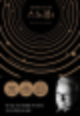

# 스노볼: 가치투자 교단의 가장 불경한 정경

"아첨이 덜한 쪽으로" 써달라고, 버핏은 그렇게 요청한다.

회계사 출신의 스타 애널리스트였던 앨리스 슈뢰더는 그 말을 액면 그대로 믿었다. 그는 위인전 대신 오마하의 현인에 대한 가장 적나라한 보고서를 작성한다.

"스노볼"이 그것이다.

막상 책이 출간되자, 버핏은 수천 시간을 함께한 작가와의 연락을 영구적으로 끊어버렸다. 작가는 출간 후 홍보 이벤트들을 홀로 소화해야만 했다.

출간 후 고작 이틀 만에 출연한 인터뷰에서조차 버핏은 1시간 내내 금융 위기 이야기만 쏟아냈을 뿐, 책에 대한 언급은 단 한 마디도 입에 올리지 않으며 철저한 침묵으로 지워버렸다. 책에 대한 버핏의 태도는 그 이후로도 여전했다.

여느 전기 작가처럼 폭로하는 '척'을 하되, 결국은 위인의 기행 정도로 포장해 기분 좋게 긁고 넘어가줬어야 했던 것일까?

아첨이 덜해도 너무 덜했던 것이다.

버크셔 주총의 VIP석에는 더 이상 슈뢰더의 자리는 마련되지 않았다. 버핏을 중심으로 똘똘 뭉친 가치투자 진영에 대한 특급 접근권은 종료되었다. 슈뢰더가 주최하던 버핏과의 비공식 연례 만찬 행사도 그날로 끝이었다.

내면의 점수판을 중시하던 버핏이 남몰래 외면의 점수판에 집착하던 사람이라는 평전의 내용을 스스로 다시금 증명해버린 것이다.

평소 그토록 '지적 정직성'과 '불편한 진실을 마주하는 합리성'을 설파하던 가치투자계는 교주님의 이 유치한 추태 앞에서 완벽하게 침묵을 지켰다.

무언가를 철저하게 숨기려는 시도만큼 흥미를 돋우는 일도 없다. 안 읽고 배길 신도가 있을까?

---
*원문 출처: [https://blog.naver.com/flionte/224404917177](https://blog.naver.com/flionte/224404917177)*
