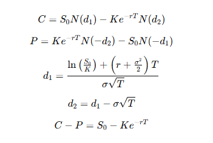

# 버핏의 마이너스 쿠폰 채권 발행 SQUARZ 사례 분석

## 2002년의 상황

당시 미국은 IT 버블의 붕괴에서 헤어 나오지 못하고 있었다.  

2000년에 최고점을 찍고 하락을 시작한 주식시장은 여전히 하락을 지속하고 있었다.  

이런 상황에서 버핏은 골드만삭스와 함께 SQUARZ라는 독특한 구조의 채권을 발행한다.  

## SQUARZ

버크셔는 2002년 5월 22일에 4억 달러 규모의 증권인 SQUARZ를 발행한다.  

SQUARZ는 선순위 채권(Senior Note)와 주식 매입 워런트가 결합된 구조이다.  

채권은 5년 만기 선순위 채권이다. 버크셔는 이 채권에 대해 연간 3%의 쿠폰 이자를 지급한다.  

워런트는 투자자에게 5년 후 버크셔를 매수할 권리를 부여한다. 행사 규모는 채권 매입 액면가 수준이다. 이 권리를 유지하기 위해, 투자자는 매년 버크셔에 3.75%의 분할 납입금을 지불해야 한다.  

버크셔는 SQUARZ에 대하여, 연간 3%의 쿠폰 이자를 지급하고, 연간 3.75%의 분할 납입금을 수취한다. 즉, 버크셔는 0.75%의 순이자를 수취하게 된다.  

워런트의 기초 자산은 버크셔 주식으로서, 클래스 A 기준 행사가격은 89,585 달러. 발행 전날인 2002년 5월 21일의 종가인 77,900 달러에 비해 15% 프리미엄이 붙었다.  

투자자는 매년 채권 발행 기념일에 보유한 채권을 액면가 그대로 버크셔에 되팔 수 있는 풋옵션을 가진다.  

| 항목 | 내용 |
| --- | --- |
| 발행사 | 버크셔 해서웨이(무디스 Aaa, S&P AAA) |
| 발행일 | 2002년 5월 22일 |
| 만기 | 2007년 5월 (5년) |
| 총 발행 규모 | 4억 달러 |
| 구성 요소 1: 채권 | 연 3% 쿠폰 이자의 선순위 채권 |
| 구성 요소 2: 워런트 | 연 3.75% 분할 납입금. 만기에 행사 가능한 유럽형 옵션 |
| 실효 쿠폰 | 연 -0.75% (버크셔가 수취) |
| 기초자산 | 버크셔 클래스 A 또는 클래스 B |
| 워런트 행사 가격 (A 주 기준) | 89,585 달러 |
| 발행 당시 주가 (A주 기준) | 77,900 달러 |
| 행사가격 프리미엄 | 15% |
| 풋옵션 | 매년 발행 기념일에 액면가로 버크셔에 채권 매도 가능 |

## 2007년 만기 상황

투자자는 매년 워런트를 유지하기 위하여 3.75%의 분할 납입금을 지불하였다.  

투자자는 매년 행사할 수 있는 채권에 대한 풋옵션을 행사하지 않았다.  

워런트 행사 시점에 버크셔 해서웨이 클래스 A 주가는 116,500 달러 수준이었다. 이는 워런트 행사 가격 89,585달러에 비해 30% 정도 높은 수준이었다.  

투자자들은 워런트를 행사한다.  

투자자들은 주식 매수 대금으로 약 4억 달러를 버크셔에 지불한다.  

버크셔는 0.75% 이자를 받으며 5년 동안 4억 달러를 빌렸으며, 4억 달러를 상환하는 대신 행사가격 89,585 달러에 4억 달러 규모의 주식을 발행하여 주식을 투자자에게 매도하였다.  

## 블랙 숄즈 모형에 대한 반박

워런 버핏과 찰리 멍거는 블랙 숄즈 모형에 대한 불신을 토로하곤 했다.  

a) 과거의 주가 변동성이 가장 중요한 변수가 되는데, 과거 주가 변동성을 기준으로 옵션의 가치를 도출하는 것은 비합리적이며,  

b) 옵션의 만기가 길어질수록 공식의 정확도는 더욱 떨어지고,  

c) 대체로 공식이 옳을지라도, 가끔을 틀릴 때가 있을 텐데, 모두가 공식을 기계적으로 적용한다  

는 것이 주요 반박 원리이다.  

*블랙 숄즈 모형*

만약 누군가가 블랙 숄즈 모형을 기계적으로 적용하여 옵션의 가치를 잘못 산정한다면, 그와의 거래를 통해 큰 이익을 얻을 수 있을 거라는 발언을 자주 한다.  

SQUARZ에 딸린 콜옵션과 풋옵션의 가치를, 버크셔의 버핏은 가장 기본적인 경제적인 원리에 따라 계산했을 것이고, 거래 상대방인 투자자들은 블랙 숄즈 모형을 기반으로 구했을 것이다.  

## 거래를 통해 얻은 버크셔의 이익

아주 간단한 계산을 통해 버크셔가 해당 거래를 통해 얻은 이익을 대충 계산해 보자.  

1) 마이너스 금리 대출  
당시 무디스 Aaa 등급의 기업채의 5년 만기 평균적인 금리는 5.5% 수준. 대략 5%라고 가정하자.  

버크셔는 SQUARZ를 통해 0.75%의 이자를 수취.  

즉, 매년 5.75%만큼의 경제적 이익을 얻었다.  

=> 4억 달러 * 5.75% * 5년 = 1억 1,500만 달러  

2) 4억 달러 대출의 투자 이익  
2000년대 당시 버크셔의 순자산 상승률을 20%가 상당히 넘었지만, 버핏이 수령한 4억 달러를 기반으로 매년 20%의 수익을 낸다고 가정하자.  

5년 복리로 20%의 수익을 거두면, 총 수익률은 148%.  

4억의 148%는 5억 9,200만 달러이다. 대략 5억 9천만 달러로 보자.  

=> 투자 이익 5억 9천만 달러  

3) 주식 저가 발행으로 인한 주주 가치 희석 손실  

투자자들의 워런트 행사 시에 발행 가격은 A주 기준 89,585 달러.  

발행 당시 버크셔 A주의 시장 가격은 약 116,528 달러.  

버크셔는 주당 89,585달러로 4억 달러의 주식을 발행하였다.  

시장 가격인 116,528 달러로 발행하지 못하고 저가 발행을 하였으니, 이를 통해 입은 경제적 손실은  

=> 4억 달러 * (116,528 - 89,585)/(89,585) = 1억 2천 30만 달러.  

대략 1억 2천만 달러 손실.  

4) 총 손익  

금리 이익 1억 1,500만 달러 + 투자 이익 5억 9천만 달러 - 주식 저가 발행 손실 1억 2천만 달러 = 5억 8천 5백만 달러.  

버크셔는 대략 5억 8천만 달러의 이익을 창출했다고 추정해볼 수 있다.  

5) 소결  

이미 일어난 일에 대해서 사후적으로 판단한 것이고, 계산도 너무나 대충해서 나온 결과지만, 버크셔가 해당 거래로 인해 상당한 이익을 볼 수 있었음을 알 수 있다.  

만약, 만기 시점에서 버크셔의 주가가 더 낮았다면, 버크셔는 주식 저가 발행의 수준을 더 낮출 수 있고, 만약 주가가 행사 가격 이하였다면 추가적인 주식 발행을 할 필요가 없었을 것이다.  

만약, 만기 시점에서 버크셔의 주가가 더 높았다면 저가 발행으로 인한 주주 가치 희석 손실은 더욱 커졌을 테지만, 그건 시장이 상당이 활황이었다는 것이고, 버핏이 4억 달러를 차입하여 얻은 투자의 이익도 그만큼 (버핏이 버크셔 주식 발행한 돈을 기반으로 새롭게 투자하고 싶을 만큼 매력적인 투자 기회였을 테니) 더 상승하였을 것이다.  

또한, 이는 버핏이 투자로 얻을 수 있는 수익률에 크게 의존한다. 버핏의 연평균 투자 수익률을 20%로 산정하여 계산을 하였지만, 버핏의 투자 수익률이 낮아진다면 계산이 크게 흐트러진다.  

만약, 버핏의 4억 달러 차입을 통해 얻은 연평균 수익률이 10%였다면, 5년간의 투자 이익은 약 5억 9천만 달러에서 약 2억 4천만 달러로 크게 축소된다. 하지만, 그럴지라도, 여전히 SQUARZ 거래의 총이익은 2억 3천9백만 달러로 상당하다.  

## 계산의 단순함

블랙 숄즈 모형과 같은 근사한 수식에 비해 계산이 너무나 단순하고 대략적이다.  

개인적인 견해로는 적어도 투자의 세계에서는 이러한 단순 계산이 오히려 더 적합하다고 본다.  

투박한 자로 측정한 수치들을 기반으로 소수점 아래 1000자리까지 정밀하게 온갖 수학적 기교를 다 동원하는 것이 무슨 의미가 있을까?  

버핏이 SQUARZ를 발행할 때 어떠한 계산을 했는지 정확히 예측할 수는 없다. 5년 뒤 만기 시점에 버크셔의 예상 주가가 어느 정도일지, 채권으로 조달한 4억 달러의 예상 수익률이 얼마가 될지, 시장의 상황에 따라 버크셔의 주가와 투자의 수익률이 어떻게 변동할지 등, 아마도 정말로 다양한 시나리오를 검토했을 것이다.  

하지만, 블랙 숄즈 모형 수준으로 복잡한 수학적 기교를 동원하진 않았을 것이다. 그리고, 그 단순한 계산이 경제적 실체에는 더욱 가까웠을 것이다.  

---
*원문 출처: [https://blog.naver.com/flionte/224036731101](https://blog.naver.com/flionte/224036731101)*
