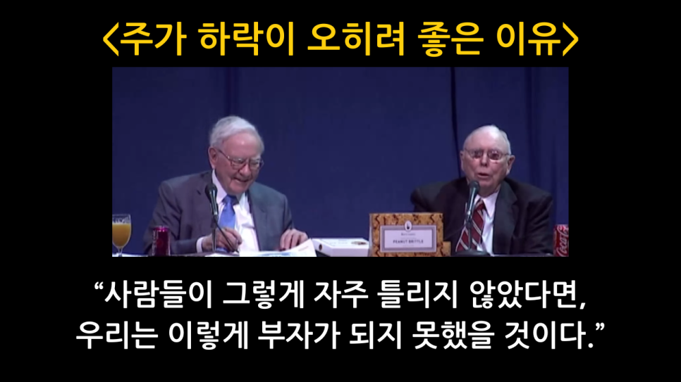

# "주가가 떨어져야 이득이다" - 버핏와 멍거의 논지

버핏과 멍거는 버크셔의 주가 혹은 매수한 기업의 주가가 낮은 편이 오히려 이득이라는 표현을 자주한다.  

그러므로 보유한 주식에 대해 주가를 띄우기 위해 좋은 말(talk up)을 하기보다는 오히려 비관적인 말을 할 거라고 말이다.  

얼핏 들으면 이상한 역설처럼 들린다.  

2015년 주주총회에서의 버핏과 멍거의 발언을 통해 이에 대해 살펴보자.  

### 장기 보유자의 관점: "앞으로도 계속 살 것이다."

버핏과 멍거의 논리는 지극히 단순하고 명쾌하다.  

그들이 내년에도, 그 후년에도, 또 그 후년에도 그 주식을 살 건데, 주가가 오르길 바랄 이유가 뭐가 있겠냐는 것이다.  

버크셔는 단기 매매차익을 노리는 트레이더가 아니라, 훌륭한 기업을 오랫동안 보유하는 소유자이다. 좋은 기업의 지분을 장기간에 걸쳐 꾸준히 늘려나가는 순매수자의 입장에 있는 것이다.  

그러므로, 주가가 저렴한 것이 오히려 좋다는 논지이다.  

### 자사주매입의 마법

현금창출력이 뛰어난 대다수의 기업들은 자사주매입 정책을 적극적으로 시행한다.  

자사주매입에서도 마찬가지로 기업의 주가가 저렴할수록 오히려 더 좋다.  

주가가 저렴할수록, 동일한 현금으로 더 많은 수의 주식을 소각할 수 있다.  

주가가 저렴할수록, 더 저렴한 가격으로 주식을 매수하여 소각할 수 있다.  

따라서, 오히려 주가가 낮은 것이 좋다.  

### 주식의 시장가격이 낮을수록 좋은 이유

전혀 어려울 것이 없는 단순 계산이다.  

자사주매입을 생각해보자.  

어떤 기업의 1주당 내재가치가 100만원이라고 하자.  

이때, 시장가격이 90만원이라면, 내재가치 100만원짜리를 10만원 더 싸게 사서 소각하는 것이므로, 그만큼 남아있는 주주들의 주당 가치가 상승한다.  

이때, 시장가격이 80만원이라면, 내재가치 100만원 짜리를 20만원 더 싸게 사서 소각하는 것이므로, 그만큼 더 남아있는 주주들의 주당 가치가 상승한다.  

이때, 시장가격이 70만원이라면, 내재가치 100만원 짜리를 30만원 더 싸게 사서 소각하는 것이므로, 그만큼 더더 남아있는 주주들의 주당 가치가 상승한다.  

자사주매입할 때, 주식의 시장 가격이 낮을수록 유리하다.  

이는 반대로 주식의 발행에 대해서도 마찬가지이다.  

어떤 기업의 1주당 내재가치가 100만원이라고 하자.  

이때, 시장가격이 110만원이라면, 내재가치 100만원짜리를 10만원 더 비싸게 발행하게 파는 것이므로, 그만큼 남아있는 주주들의 주당 가치가 상승한다.  

이때, 시장가격이 120만원이라면, 내재가치 100만원짜리를 20만원 더 비싸게 발행하게 파는 것이므로, 그만큼 더 남아있는 주주들의 주당 가치가 상승한다.  

이때, 시장가격이 130만원이라면, 내재가치 100만원짜리를 30만원 더 비싸게 발행하게 파는 것이므로, 그만큼 더더 남아있는 주주들의 주당 가치가 상승한다.  

주식을 발행할 때, 주식의 시장 가격이 높을수록 유리하다.  

물론, 버핏과 멍거는 주식의 추가 발행에 대해 극도로 보수적인 관점을 가지고 있어서, 내재가치보다 주가가 비싸다는 이유로 주식을 발행하는 경우는 없다. 기업의 인수 과정에서 버크셔 주식으로 대금을 지급하는 경우 정도를 제외하면 말이다.  

### 멍거의 일침: "사람들이 틀리지 않았다면, 우리는 부자가 되지 못했을 것"

다른 사람들의 그렇게 무지하지 않았다면 자신들은 이렇게 부자가 될 수 없었을 것이라는 발언을 찰리 멍거는 자주 한다.  

이는 단순한 농담이 아니다.  

대다수의 시장 참여자들이 가격과 가치를 혼동하며, 단기적인 주가 등락에 일희일비하는 비합리성을 보이기 때문에, 역으로 그 경제적 실체를 꿰뚫어 보는 투자자는 막대한 부를 쌓을 수 있다는 의미이다.  

---
*원문 출처: [https://blog.naver.com/flionte/224046316948](https://blog.naver.com/flionte/224046316948)*
