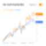

# 2024년 수익률 34% 마무리

작년에 이어 수익률을 기록한다.

| 연도 | 수익률 | S&P500 | 나스닥 | 코스피 | 코스닥 |
| --- | --- | --- | --- | --- | --- |
| 2023 | 33% | 24% | 43% | 19% | 28% |
| 2024 | 34.5% | 25%(배당 재투자) | 29.6% (배당 재투자) | -9.6% | -21.7% |
|  |  |  |  |  |  |

스스로 벤치마크 수익률이라고 생각하는 S&P500지수 대비 9%의 초과수익을 거뒀다. 작년과 같다.

개인적인 재무위기로 인하여 현금비중은 거의 없었다.

현금이 부족하여, 새로운 기업을 매수하기 위해 기존 보유 주식을 꽤나 매도해야 했다. 올해 상당한 양도소득세를 내야할테고, 이것이 수익률을 꽤나 끌어내릴 것이다.

포트폴리오의 대부분을 차지하고 있는 미국 기업들이 대부분 시장 대비 아주 높은 초과수익률을 가져다주었다. 특히, 새롭게 미국에 투자한 세 종목이 시기적절하게 주가가 급등하여 수익률을 끌어올렸다. 새롭게 투자하기 위해 꽤 많은 주식을 매도했는데, 그 타이밍이 참으로 시기적절했다. 시점 선택은 고려하고 있지 않으니, 그저 운이 너무나 좋았던 셈이다.

아주 높게 유지하고 있는 중국 비중이 수익률을 꽤나 끌어내렸다.

아주 낮게 유지하고 있는 한국 비중이 수익률을 약간 끌어내렸다. 새롭게 주식을 매수하기 위해 한국 기업 한 종목의 주식을 대거 손절하고 기존 보유량 대비 10% 정도만을 남겨두었는데, 매도 이후 주가가 급등했다.

2023년도부터 매매 타이밍에서 운이 지나치게 좋다. 투자에서의 행운과 개인적인 삶에서의 불운이 균형을 맞추는 걸까, 하는 이상한 생각도 해본다.

2025년은 어떻게 될까. 새로운 투자 기회를 항상 살펴보고 있는데 상당히 찾기 어렵다. 매력적으로 보이는 기업들이 좀 있긴 한데, 모두 중국과 한국의 기업들이다. 중국은 정부의 개입 문제, 한국은 경영권을 쥔 대주주 일가의 전횡으로 인해 투자하기 꺼려지는 시장이라 고민이 크다.

---
*원문 출처: [https://blog.naver.com/flionte/223712294775](https://blog.naver.com/flionte/223712294775)*
