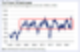
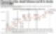
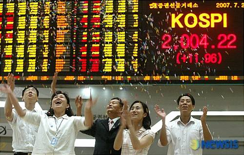

# 한국 주식의 죽음? 1979년과 2024년

주식의 죽음
이번 연말에는 "주식의 죽음(The Death of Equities)"라는 1979년 비즈니스위크 기사를 읽었다.

[번역] 주식의 죽음(1979)
#1
: 네이버 블로그

> 🔗 [[번역] 주식의 죽음(1979) #1](https://blog.naver.com/thegeneralfox/222974001627)

계획하고 읽은 건 아니었다. 술이 덜 깬 채로 오전에 컴퓨터를 멍하게 뒤적이다가 우연히 이 기사를 다시 접했다.

당시 미국의 주식시장은 1960년대부터 시작된 거의 20년 동안의 박스권에 갇혀 등락을 거듭하고 있었다.

특히, 70년대 초 니프티피프티 버블 이후의 폭락장은 좀처럼 회복되지 않고 있었다. (찰리 멍거는 이 시기에 운영하던 파트너쉽에서 큰 손실을 입으며 연평균 수익률이 대폭 하락했다. 워런 버핏은 버블이 터지기 직전 파트너쉽을 해체하며 이를 피해갔다.)

이 기사는 당시 미국 주식시장의 암울한 상황을 분석하며 주식의 죽음을 선언한다. 읽어보면 알겠지만 설득력이 대단하다.

뛰어난 스토리텔러들은 최악의 분석가라는 개인적인 편견이 있다. 다행히, 이 기사도 그러하다.

1년뒤인 1980년부터 미국의 주식시장은 부활하기 시작했고, 이내 눈부신 성장을 이어간다.

한국 주식의 죽음?
'한국 주식의 죽음'이라는 주제에 많은 이들이 공감하는 듯하다.

기업의 이익은 상승하지만 주주가치는 좀처럼 상승하지 않는 한국의 주식 시장.

기업가치의 상승이 주주가치의 상승으로 자연스럽게 이어지는 미국 주식시장을 접하고 이에 익숙해진 개인 투자자들은 이제는 한국 주식시장을 떠나고 있다.

*2007년 7월 2일. 코스피 2000 축하해.*

개인적으로도, 포트폴리오에서 한국 기업의 비중이 30%가 넘었던 게 언제적인지 이제는 정말 까마득하다.

미국 주식시장과 한국 주식시장의 격차가 엄청났던 2024년을 겪으면서 개인투자자들의 국장에 대한 회의감은 점차 커지고 있다.

미국의 거버넌스
연말에 쉬면서 미국 주식시장의 역사를 쭉 살펴보았다. 특히, 주주 자본주의가 정착되는 과정을 중심으로.

미국도 지금의 지배구조가 어느날 갑자기 하늘에서 뚝 떨어진 것은 아니다. 소위 강도귀족들이 수단과 방법을 가리지 않았던 시대도 있었다.

1919년의 닷지 vs 포드 판결, 증권법과 증권거래법의 제정, 수탁자의 의무 및 충실의무의 강화, 대리인 이론에 대한 연구, 70년대와 80년대의 주주행동주의의 심화...

오랜 기간에 걸친 제도의 개선과 문화의 변화가 쌓여 오늘날의 미국 주식 시장을 만든 것이다.

한국의 거버넌스
한국의 주식시장도 서서히 개선의 발걸음을 시작하고 있다. 밸류업 정책, 상법 개정안, 자본시장법 개정안 같은 제도 개선 방안이 추진되고 있다.

곧바로 제도의 개선이 완벽하게 이루어지고, 하루아침에 모든 문제가 해결되지는 않을 것이다.

하지만 분명, 예전에는 꿈도 못 꾸던 변화가 시작되고 있다.

LG에너지솔루션의 물적분할 후 상장에 대해 엄청난 비난 여론이 생기고, 정부가 밸류업 정책을 발표하고, 야당이 상법 개정안을 제시하고, 두산의 분할합병이 결국 무산되고, 기업들이 앞다퉈서 주주가치 제고 방안을 발표하고...

한국판 '주식의 죽음'이기를
뛰어난 영업 능력을 가졌지만 최악의 자본 배분을 하고 있는 한국의 기업들을 추려보고 있다.

지배구조 문제만 아니었다면 절대로 현재의 처참한 시가총액 수준일리가 없는 양질의 기업이 한국에 너무나 많다는 건 새삼 놀라운 일도 아니다.

"국장 탈출은 지능순", "인버스도 국장" 같은 자극적인 말들이 시장에 가득찬 지금, 한국 주식 시장은 끝났다고 단언하는 이 수많은 목소리들이, 부디 1979년 뉴스위크의 '주식의 죽음'처럼 잘못된 비관의 예언으로 남기를.

---
*원문 출처: [https://blog.naver.com/flionte/223713670487](https://blog.naver.com/flionte/223713670487)*
