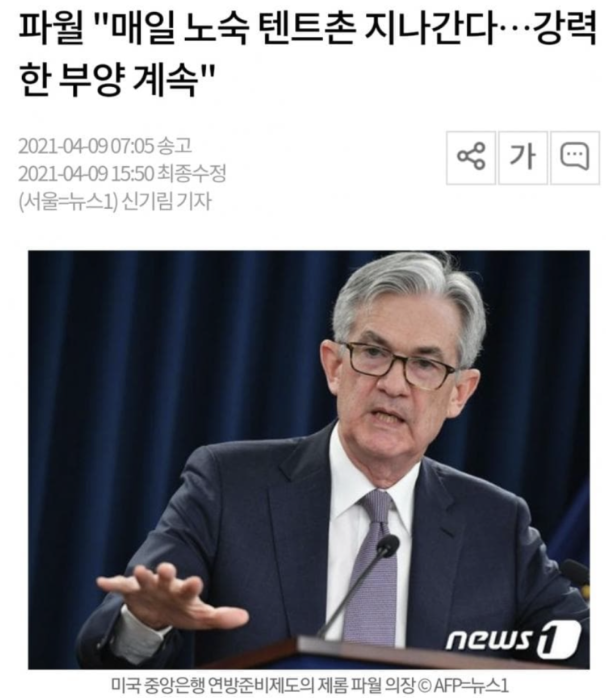
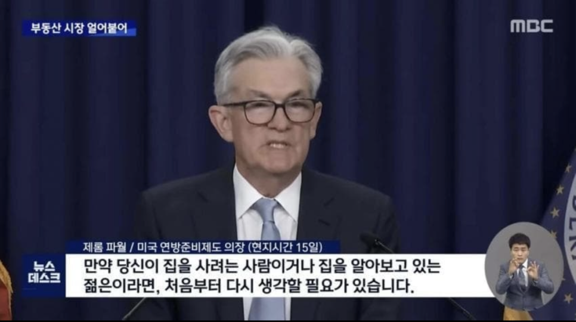
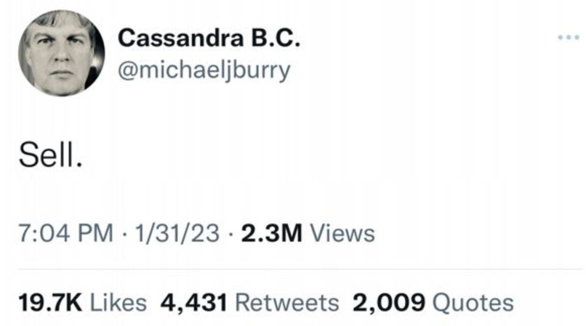

# 금리, 물가에 대한 시장의 호들갑 정리(2020년~)

## 2020년

"제로 금리 뉴노멀": 앞으로 구조적으로 금리가 올라갈 수 없다고 믿으며, 이는 SPAC, NFT, ARKK와 같은 극도로 투기적인 현상을 불러옴  

[기준금리]  
2019.10.31 : 1.50 ~ 1.75  
2020.03.04 : 1.00 ~ 1.25 (50 bp 하락)  
2020.03.16 : 0.00 ~ 0.25 (100 bp 하락)  

## 2021년

"일시적 인플레이션": 미 행정부, 연준, 대다수의 경제학자들은 인플레이션은 일시적이라고 주장.  
현대통화이론(MMT)의 유행  
연준의 강력한 경기 부양 의지.  
2021년 9월: 연준은 2024년까지 금리 인상 없을 것이라 예측을 발표.  
여전히 기업의 성장이 영구적으로 이어질 것이라는 믿음. 주가 상승이 이어짐. 저금리 시대에 투자 안 하면 돈이 삭제된다는 논리가 팽배.  
메타버스 광풍.  

[기준금리]  
변동없음  

*2021년 연준의 강력한 부양 의지*

## 2022년

하이퍼 인플레이션 공포  
베네수엘라, 바이마르 공화국 등의 사례가 대중에게 알려지기 시작.  
"현금은 쓰레기"  
연준은 금리를 급격하게 인상하며, 1년에 걸친 시장의 하락으로 이어짐.  
"경기 침체 확신": 경제학자들과 기업들 사이에 비관론이 확산. 제이미 다이먼은 "허리케인"이 올 것이라 경고.  

[기준 금리]  
2022.03.17 : 0.25 ~ 0.50 (25 bp 상승)  
2022.05.05 : 0.75 ~ 1.00 (50 bp 상승)  
2022.06.16 : 1.50 ~ 1.75 (75 bp 상승)  
2022.07.28 : 2.25 ~ 2.50 (75 bp 상승)  
2022.09.22 : 3.00 ~ 3.25 (75 bp 상승)  
2022.11.03 : 3.75 ~ 4.00 (75 bp 상승)  
2022.12.15 : 4.25 ~ 4.50 (50 bp 상승)  

*1년만에 돌변한 연준*

## 2023년

마이클 버리: "Sell"  
실리콘밸리은행(SVB) 파산 사태. 시스템 붕괴에 관한 공포 확산  
시장은 다시 안정을 찾고 성장을 이어감.  

[기준금리]  
2023.02.02 : 4.50 ~ 4.75 (25 bp 상승)  
2023.03.23 : 4.75 ~ 5.00 (25 bp 상승)  
2023.05.04 : 5.00 ~ 5.25 (25 bp 상승)  
2023.07.27 : 5.25 ~ 5.50 (25 bp 상승)  

## 2024년

디플레이션 위기설: "중국이 세계에 디플레이션을 수출하고 있다"  
하지만, 무난한 성장세가 이어짐.  

[기준금리]  
2024.09.19 : 4.75 ~ 5.00 (50 bp 하락)  
2024.11.08 : 4.50 ~ 4.75 (25 bp 하락)  
2024.12.19 : 4.25 ~ 4.50 (25 bp 하락)  

## 2025년

스테그플레이션 위기설. 1년도 채 안 돼서 이젠 물가가 너무 높아서 문제라고 난리치기 시작.  
4월 이후 다시 시장의 폭등.  

[기준금리]  
2025.09.18 : 4.00 ~ 4.25 (25 bp 하락)  
2025.10.30 : 3.75 ~ 4.00 (25 bp 하락)  
2025.12.11 : 3.50 ~ 3.75 (25 bp 하락)  

## 2026년

"화폐가치가 쓰레기가 되어가고 있다": 현재 진행 중.  
대충 내가 당장 생각나는 것만 이 정도다. 그 사이에 얼마나 많은 각종 내러티브가 있었는지 조사하면 아마 끝도없이 나올 것이다.  
언론과 유튜브는 대중의 관심을 통해 현금흐름을 창출한다.  

그 인센티브는 뇌에 엄청난 영향을 미친다.  

인간은 자신에게 가장 이익이 되는 방향으로 합리화하기 십상이다.  

---
*원문 출처: [https://blog.naver.com/flionte/224155645896](https://blog.naver.com/flionte/224155645896)*
