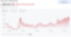

# 환율이 오르면 나라가 망해간다는 게으른 생각

환율이 오르면 나라가 망하고 있고, 환율이 내려가면 나라가 잘나가고 있다는 생각.

일종의 경제학적 부두술이라고 본다.

국가가 부유해질수록 실질환율이 강세를 보인다는 상당히 합리적인 경제적 직관에도 불구하고, 환율의 강세든 약세든, 그게 항상 그 나라의 경제력을 반영하는 건 아니다.

독일과 일본의 국민을 부유하게 만들기 위해 미국이 패권을 동원하여 마르크화와 엔화를 절상시켰을리가 없다.

지난 10년간 태국 경제가 너무나 좋아져서 바트화가 끝없는 강세를 나타냈을리가 없다

구매력평가설이 그나마 가장 합리적인 환율에 대한 이론이겠지만 현실의 외환시장은 결코 햄버거 가격대로 돌아가지 않는다.

환율의 상승을 곧 '국가 부도'와 동일시하는 이 뿌리 깊은 공포는 1997년 외환 위기가 우리 집단 무의식에 남긴 경로의존성일지도 모른다.

그래서였을까. 환율에 대한 논의는 경제학의 범위를 넘어 지극히 정치적으로 흘러갔다. 무서워서 환율에 대한 이야기에 참여할 생각도 못했다.

이창용 전 한국은행 총재가 환율 상승의 구조적인 요인을 경제학적으로 언급했을 뿐인데, "국민 탓을 한다"며 정치적 논란의 한가운데 놓이는 것을 보며 소름이 끼쳤다.

맘껏 분노를 토해놓고 보면 기분은 통쾌하겠지만, 환율이라는 건 정말 너무나 복잡한 이야기다.

투자 이야기를 해보자면: 한낱 개미인 나에게 환율은 그저 하늘이 점지해주는 것이라 본다. 별수 없다.

---
*원문 출처: [https://blog.naver.com/flionte/224387676334](https://blog.naver.com/flionte/224387676334)*
